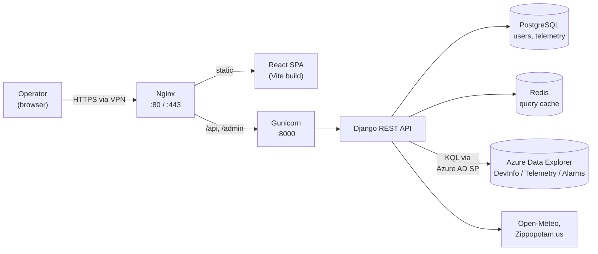
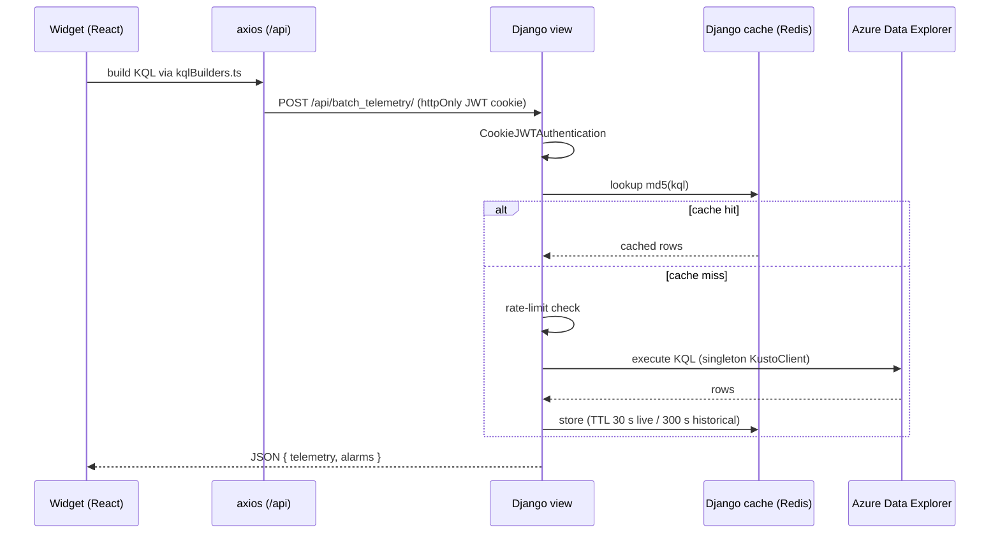
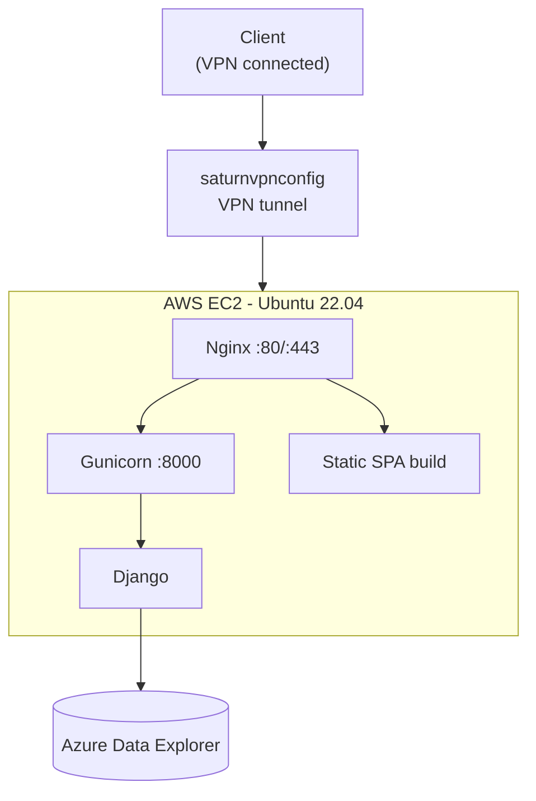

# mysite — Edge Telemetry Dashboard

A full-stack web application for monitoring distributed energy resources (solar PV, grid, battery, and load) using telemetry streamed into **Azure Data Explorer (ADX)**.

Django REST API + React SPA, containerised with Docker and served behind Nginx.

[](https://www.djangoproject.com/)
[](https://react.dev/)
[](https://www.typescriptlang.org/)
[](https://vite.dev/)
[](#license)

---

## Table of Contents

- [Access Requirements](#access-requirements)
- [Features](#features)
- [Architecture](#architecture)
- [Tech Stack](#tech-stack)
- [Getting Started](#getting-started)
- [Configuration](#configuration)
- [API Reference](#api-reference)
- [Project Structure](#project-structure)
- [Development](#development)
- [Deployment](#deployment)
- [Operations](#operations)
- [Troubleshooting](#troubleshooting)
- [Security](#security)
- [Documentation](#documentation)
- [Contributing](#contributing)
- [License](#license)

---

## Access Requirements

> [!IMPORTANT]
> **The `saturnvpnconfig` VPN is mandatory for all users.**
>
> The application runs on a private AWS EC2 instance inside a restricted VPC and queries Azure Data Explorer. Without an active VPN session the dashboard, the API, and the ADX backend are all unreachable.

Contact your IT administrator or project lead to request the VPN profile. See the [VPN Access Guide](docs/VPN_ACCESS.md) for platform-specific setup.

---

## Features

### Real-time monitoring

- **Device lookup by serial** — every view is scoped to a single `comms_serial`; searching a serial hydrates the entire dashboard.
- **Instantaneous gauges** — animated analog needle gauges, battery state-of-charge gauge, inverter mode display, and cellular/Wi-Fi signal indicators.
- **41 time-series widgets** — PV voltage/current (4 channels each), grid and load voltage/current/frequency (L1/L2), and per-module battery voltage, temperature, SoC, and current for 3 battery modules.
- **Dual sampling modes** — normal (15-minute aggregation) and fast (15-second) per widget.
- **Discrete-state widgets** — inverter operating state, ETP connection status, and BGCS grid relay position, mapped from raw numeric codes to human-readable labels.
- **Energy flow diagram** — SVG visualisation of PV → grid / battery / load power flow.
- **Configurable auto-refresh** — Off, 5 s, 10 s, 30 s, 1 min, 5 min.

### Events and analytics

- **Event log** — alarm/event records sourced from the ADX `Alarms` table.
- **Pareto analysis** — event frequency bars with a cumulative-percentage overlay.
- **Top events** — ranked bar chart of the most frequent alarms.
- **Filters** — severity (Critical / Warning / Info, derived from the alarm name), output state (Active `1`, Inactive `0`, All), free-text search, and date range.

### Cross-cutting

- **Global time range** — 7 presets (15 m → 7 d) plus a custom picker; propagates to every widget.
- **Timezone selection** — site-local rendering of all timestamps, with ZIP-code → IANA timezone resolution.
- **Weather correlation** — hourly weather for the site ZIP code, overlaid against telemetry.
- **Dark / light theming** — driven entirely by CSS custom properties; no hard-coded colours.
- **Exports** — per-widget CSV download and full-dashboard PDF export.

---

## Architecture

### System context



### Request flow for a telemetry widget



### Key design decisions

| Decision | Rationale |
| --- | --- |
| **ADX is the system of record for telemetry** | Time-series data is never copied into the relational database. The API is a thin, authenticated, cached query proxy. PostgreSQL stores only users and a small local `Telemetry` staging model. |
| **JWT in `httpOnly` cookies** | Tokens are unreachable from JavaScript, eliminating the XSS token-theft vector. A custom `CookieJWTAuthentication` class reads them, with header-based `JWTAuthentication` retained as a fallback. |
| **Server-side query cache and rate limiter** | ADX bills per query. Results are keyed by an MD5 of the KQL text with short TTLs, and an in-process limiter caps queries per minute. |
| **Batch endpoint** | `POST /api/batch_telemetry/` collapses many metric lookups into a single `summarize arg_max(...) by name` query instead of N round trips. |
| **Staggered widget loading** | The dashboard fires its five widget groups with 50–250 ms offsets to avoid a thundering herd against ADX on page load. |
| **Context API instead of Redux** | State is coarse-grained and mostly ambient (serial, time range, theme, timezone, refresh interval); six focused providers keep the dependency graph flat. |
| **CSS custom properties for theming** | Theme switching is instantaneous and every component inherits it without prop drilling; Tailwind maps its utilities onto the same variables. |

### ADX data model

| Table | Purpose | Key columns |
| --- | --- | --- |
| `DevInfo` | Device registry and metadata | `comms_serial`, model, firmware, MAC, last seen |
| `Telemetry` | Numeric time series | `comms_serial`, `name` (hierarchical path, e.g. `/INV/DCPORT/STAT/PV1/V`), `value_double`, `localtime` |
| `Alarms` | Discrete events and alarms | `comms_serial`, `name` (e.g. `/BMS/CLUSTER/EVENT/ALARM/MAIN_RELAY_ERROR`), `value` (`0`/`1`), `localtime` |

---

## Tech Stack

### Backend

| Component | Version |
| --- | --- |
| Python | 3.11 |
| Django | 5.2.7 |
| Django REST Framework | 3.16.1 |
| djangorestframework-simplejwt | 5.5.1 |
| django-cors-headers | 4.9.0 |
| django-jazzmin (admin theme) | 3.0.1 |
| azure-kusto-data / azure-identity | 5.0.3 / 1.23.0 |
| psycopg2-binary | 2.9.10 |
| redis | 5.2.1 |
| gunicorn | 23.0.0 |
| whitenoise | 6.9.0 |

### Frontend

| Component | Version |
| --- | --- |
| React / React DOM | 19.1.1 |
| TypeScript | 5.9.3 |
| Vite | 7.1.7 |
| react-router-dom | 7.9.6 |
| axios | 1.13.4 |
| Chart.js + react-chartjs-2 | 4.5.1 / 5.3.1 |
| Recharts | 3.6.0 |
| Tailwind CSS | 4.1.17 |
| date-fns / react-datepicker | 4.1.0 / 8.9.0 |
| html2canvas / jsPDF | 1.4.1 / 4.1.0 |
| ESLint | 9.36.0 |

### Infrastructure

Docker (multi-stage) · Nginx · Gunicorn (`gthread`) · Supervisor (non-Docker VM) · PostgreSQL 15 · Redis 7 · AWS EC2 (Ubuntu 22.04)

---

## Getting Started

### Prerequisites

| Requirement | Version | Notes |
| --- | --- | --- |
| Python | 3.11+ | |
| Node.js | 20+ | 18 works; 20 is used in the Docker build |
| Docker and Docker Compose | latest | Only for containerised runs |
| Azure AD service principal | — | Requires `Viewer` on the ADX database |
| VPN | `saturnvpnconfig` | Required for ADX reachability |

All routine commands are wrapped in the [Makefile](Makefile). Run `make help` for the full list.

### Option A — Docker (recommended)

```bash
make env                     # creates .env from .env.example
# Edit .env: DJANGO_SECRET_KEY, JWT_SIGNING_KEY, DB_*, ADX_*

make up                      # build and start all containers
make docker-superuser        # create an admin user
make health                  # verify
```

Migrations and `collectstatic` run automatically via `deploy/scripts/entrypoint.sh`.

### Option B — Local development

```bash
make setup                   # .env + venv + backend and frontend dependencies
# Edit .env before continuing
make migrate
make superuser
```

Then start the two servers in separate terminals:

```bash
make dev-backend             # http://127.0.0.1:8000
make dev-frontend            # http://localhost:5173
```

<details>
<summary>Equivalent commands without <code>make</code></summary>

```bash
# Backend
cd backend
python -m venv venv
.\venv\Scripts\activate      # Windows
# source venv/bin/activate   # macOS / Linux
pip install -r requirements.txt
cp ../.env.example ../.env   # then edit
python manage.py migrate
python manage.py createsuperuser
python manage.py runserver

# Frontend
cd frontend
npm install
npm run dev
```

</details>

Vite proxies `/api` to `http://localhost:8000`, so cookie-based authentication works without CORS exemptions during development.

### Access points

| Service | Docker | Local dev |
| --- | --- | --- |
| Dashboard | `http://localhost/` | `http://localhost:5173/` |
| REST API | `http://localhost/api/` | `http://localhost:8000/api/` |
| Django admin | `http://localhost/admin/` | `http://localhost:8000/admin/` |
| Health check | `http://localhost/api/health/` | `http://localhost:8000/api/health/` |

---

## Configuration

All configuration is environment-driven. Copy [.env.example](.env.example) to `.env`. **Never commit `.env`.**

### Django core

| Variable | Default | Description |
| --- | --- | --- |
| `DJANGO_ENVIRONMENT` | `development` | `production` enables startup validation and hardened security settings |
| `DJANGO_SECRET_KEY` | — | **Required in production**; startup fails without it |
| `DJANGO_DEBUG` | `False` | Must be `False` in production |
| `DJANGO_ALLOWED_HOSTS` | `localhost,127.0.0.1` | Comma-separated; wildcards rejected in production |
| `DJANGO_LOG_LEVEL` | `INFO` | Console logging level |

### Security

| Variable | Default | Description |
| --- | --- | --- |
| `DJANGO_SECURE_SSL_REDIRECT` | `False` | Force HTTPS redirect |
| `DJANGO_SESSION_COOKIE_SECURE` | `False` | `Secure` flag on the session cookie |
| `DJANGO_CSRF_COOKIE_SECURE` | `False` | `Secure` flag on the CSRF cookie |
| `CSRF_TRUSTED_ORIGINS` | dev localhost origins | Comma-separated |
| `CORS_ALLOWED_ORIGINS` | `http://localhost:5173,http://127.0.0.1:5173` | Comma-separated; never `*` |
| `JWT_SIGNING_KEY` | `fallback-secret` | **Override in production** |

HSTS (1 year), `X-Frame-Options: DENY`, content-type sniffing protection, and `SECURE_PROXY_SSL_HEADER` are enabled automatically when `DJANGO_ENVIRONMENT=production`.

### Database

| Variable | Default |
| --- | --- |
| `DB_ENGINE` | `django.db.backends.sqlite3` |
| `DB_NAME` | `db.sqlite3` |
| `DB_USER` | `mysite_user` |
| `DB_PASSWORD` | — |
| `DB_HOST` | `localhost` |
| `DB_PORT` | `5432` |

PostgreSQL connections are pooled with `CONN_MAX_AGE=60`.

### Azure Data Explorer

| Variable | Default | Description |
| --- | --- | --- |
| `ADX_CLUSTER_URL` (alias `ADX_CLUSTER_URI`) | — | e.g. `https://<cluster>.<region>.kusto.windows.net` |
| `ADX_DATABASE` | — | Target ADX database |
| `ADX_CLIENT_ID` | — | Azure AD application (client) ID |
| `ADX_CLIENT_SECRET` | — | Service principal secret |
| `ADX_TENANT_ID` | — | Azure AD tenant ID |
| `ADX_CACHE_TTL` | `30` | Cache TTL (seconds) for live queries |
| `ADX_CACHE_TTL_HISTORICAL` | `300` | Cache TTL (seconds) for historical queries |
| `ADX_MAX_QUERIES_PER_MINUTE` | `60` | Per-process rate limit |

### Cache and runtime

| Variable | Default |
| --- | --- |
| `CACHE_BACKEND` | `memory` (`redis` in Docker) |
| `REDIS_URL` | `redis://127.0.0.1:6379/1` |
| `GUNICORN_BIND` | `0.0.0.0:8000` |
| `GUNICORN_WORKERS` | `4` |
| `GUNICORN_THREADS` | `2` |
| `GUNICORN_LOG_LEVEL` | `info` |

### Frontend build-time

| Variable | Default |
| --- | --- |
| `VITE_API_URL` | `http://localhost:8000/api` |
| `VITE_WS_URL` | `ws://localhost:8000/ws` (reserved) |

---

## API Reference

Base path: `/api/`. Authentication uses `httpOnly` cookies (`access_token`, `refresh_token`) set by `/api/login/`; an `Authorization: Bearer <token>` header is also accepted.

Access token lifetime is **120 minutes**, refresh token **5 days**, with rotation enabled.

### Authentication

| Method | Path | Auth | Body / params | Returns |
| --- | --- | --- | --- | --- |
| `POST` | `/api/register/` | Public | `username`, `password` | `201` `{ detail }` |
| `POST` | `/api/login/` | Public | `username`, `password` | `{ detail, user }` plus auth cookies |
| `POST` | `/api/logout/` | Public | — | `{ detail }`; clears cookies |
| `POST` | `/api/token/` | Public | `username`, `password` | SimpleJWT token pair *(legacy)* |
| `POST` | `/api/token/refresh/` | Cookie | reads `refresh_token` | `{ detail }` plus rotated cookies |
| `GET` | `/api/auth/me/` | Required | — | `{ user: { username, email } }` |

### Telemetry (relational)

| Method | Path | Auth | Purpose |
| --- | --- | --- | --- |
| `GET` | `/api/telemetry/` | Required | Paginated list |
| `POST` | `/api/telemetry/` | Required | Create record |
| `GET` | `/api/telemetry/{id}/` | Required | Retrieve |
| `PUT` / `PATCH` | `/api/telemetry/{id}/` | Required | Update |
| `DELETE` | `/api/telemetry/{id}/` | Required | Delete |

### Azure Data Explorer

| Method | Path | Auth | Body | Purpose |
| --- | --- | --- | --- | --- |
| `POST` | `/api/batch_telemetry/` | Required | `{ serial, telemetry_names[], alarm_names[] }` | **Preferred.** Single-round-trip fetch of latest values for many metrics and alarms |
| `POST` | `/api/search_serial/` | Required | `{ serial }` | Device metadata from `DevInfo`; `404` if unknown |
| `POST` | `/api/query_adx/` | Required | `{ kql }` | Raw KQL passthrough *(legacy)* |
| `GET` | `/api/adx/` | `AdminGroup` | — | Diagnostic sample query against `DevInfo` |
| `GET` | `/api/adx_stats/` | Required | — | Cache hit/miss and rate-limiter statistics |

> [!WARNING]
> `/api/query_adx/` executes arbitrary caller-supplied KQL. It is retained for backwards compatibility only; new widgets must use `/api/batch_telemetry/`. See [Security](#security).

### Site context

| Method | Path | Auth | Body | Purpose |
| --- | --- | --- | --- | --- |
| `POST` | `/api/geo_timezone/` | Required | `{ zip, country }` | ZIP code → location, IANA timezone, UTC offset |
| `POST` | `/api/weather/` | Required | `{ zip, start_date, end_date, country }` | Hourly weather (Open-Meteo) for the site |

### Operations

| Method | Path | Auth | Purpose |
| --- | --- | --- | --- |
| `GET` | `/api/health/` | Public | `200` healthy / `503` degraded, with per-dependency checks for `database`, `redis`, `adx` |

---

## Project Structure

```text
mysite/
├── backend/                          # Django REST API
│   ├── config/
│   │   ├── settings.py               # Environment-aware settings
│   │   ├── urls.py                   # Root router (auth + /api include + /admin)
│   │   ├── wsgi.py / asgi.py
│   ├── apps/telemetryapp/
│   │   ├── models.py                 # Telemetry model
│   │   ├── serializers.py            # TelemetrySerializer, RegisterSerializer
│   │   ├── views.py                  # Auth, ADX, weather, health endpoints
│   │   ├── urls.py                   # App routes
│   │   ├── authentication.py         # CookieJWTAuthentication
│   │   ├── permissions.py            # IsAdminGroup
│   │   ├── adx_service.py            # Basic Kusto client
│   │   ├── adx_optimized.py          # Cached, rate-limited, batching client
│   │   ├── weather_service.py        # Zippopotam.us + Open-Meteo
│   │   └── migrations/
│   ├── logs/                         # Application logs
│   ├── manage.py
│   └── requirements.txt
│
├── frontend/                         # React + Vite + TypeScript SPA
│   └── src/
│       ├── components/
│       │   ├── widgets/              # 41 time-series widgets + BaseTimeSeriesWidget
│       │   ├── gauges/               # Analog needle, battery SoC, inverter mode
│       │   ├── layout/               # NavBar, Footer, DashboardLayout, WidgetCard
│       │   └── common/               # Logo, CollapsibleSection
│       ├── pages/                    # Events, History, Settings, Firmware, About, StyleGuide
│       ├── context/                  # Auth, Theme, Serial, TimeRange, RefreshInterval, Timezone
│       ├── hooks/                    # useAdxQuery, useAutoFetch, useOptimizedTelemetry, useWidgetState
│       ├── services/api.ts           # axios instance (baseURL /api, withCredentials)
│       ├── utils/                    # kqlBuilders, chartHelpers, dateHelpers, timezone, eventsParser
│       ├── styles/                   # Design tokens and shared style objects
│       └── index.css                 # CSS custom-property theme system
│
├── deploy/
│   ├── config/
│   │   ├── nginx.conf                # VM reverse proxy (upstream 127.0.0.1:8000)
│   │   ├── nginx-docker.conf         # Container reverse proxy (upstream backend:8000)
│   │   ├── gunicorn.conf.py          # gthread workers, max-requests recycling
│   │   └── supervisord.conf          # Process manager for non-Docker VM
│   └── scripts/
│       ├── setup-azure-vm.sh         # First-time host provisioning
│       ├── entrypoint.sh             # wait-for-db → migrate → collectstatic → gunicorn
│       ├── deploy.sh                 # Build, up, health-check, prune
│       └── backup.sh                 # Database / media / log backup
│
├── docs/
│   ├── SRS.md                        # Software Requirements Specification
│   ├── TROUBLESHOOTING.md            # Symptom-driven diagnostic guide
│   ├── DEPLOYMENT_MANAGEMENT.md      # Release process, rollback, contacts
│   ├── PROJECT_ARCHITECTURE.md
│   ├── DASHBOARD_REDESIGN_COMPLETE.md
│   └── VPN_ACCESS.md
│
├── .env.example
├── Makefile                          # All supported commands (make help)
├── docker-compose.yml
├── Dockerfile                        # 3 stages: frontend-builder → backend → nginx
└── README.md
```

---

## Development

### Commands

Every supported command is a `make` target. Run `make help` to list them with descriptions.

| Task | Target | Underlying command |
| --- | --- | --- |
| One-time local setup | `make setup` | venv + `pip install` + `npm ci` |
| Backend dev server | `make dev-backend` | `python manage.py runserver` |
| Frontend dev server | `make dev-frontend` | `npm run dev` |
| Create migrations | `make makemigrations` | `python manage.py makemigrations` |
| Apply migrations | `make migrate` | `python manage.py migrate` |
| Detect missing migrations | `make migrate-check` | `makemigrations --check --dry-run` |
| Collect static files | `make collectstatic` | `collectstatic --noinput` |
| Create admin user | `make superuser` | `createsuperuser` |
| Django shell | `make shell` | `python manage.py shell` |
| Backend tests | `make test` | `python manage.py test` |
| Lint frontend | `make lint` | `npm run lint` |
| Production readiness check | `make check-deploy` | `python manage.py check --deploy` |
| Frontend production build | `make build-frontend` | `npm run build` |
| Start containers | `make up` | `docker compose up -d --build` |
| Stop containers | `make down` | `docker compose down` |
| Container logs | `make logs-backend` | `docker compose logs -f backend` |
| Shell into a container | `make sh SERVICE=backend` | `docker compose exec backend bash` |
| Health check | `make health` | `curl /api/health/` |
| Deploy (scripted) | `make deploy` | `deploy/scripts/deploy.sh` |
| Deploy to the VM | `make vm-deploy` | SSH pull, migrate, build, restart |
| Backup | `make backup` | `deploy/scripts/backup.sh` |

> `make` requires GNU Make. On Windows use Git Bash, WSL, or install it with `choco install make`.

### Conventions

- **Adding a telemetry widget** — add a KQL builder to `frontend/src/utils/kqlBuilders.ts`, register metadata (label, unit, colour scheme, value mapping) in `frontend/src/components/widgets/widgetConfigs.ts`, then compose `BaseTimeSeriesWidget`. Avoid new bespoke chart components.
- **Colours** — reference design tokens (`text-primary`, `accent-cyan`, `status-critical`, and so on). Hard-coded hex values break theme switching.
- **API calls** — always go through `frontend/src/services/api.ts` so `withCredentials` and the 401-refresh interceptor apply.
- **New ADX access** — extend `/api/batch_telemetry/` rather than adding raw-KQL call sites.

### Frontend design system

Themes are defined as CSS custom properties in `frontend/src/index.css` and surfaced to Tailwind via `tailwind.config.js`.

| Token group | Examples |
| --- | --- |
| Background | `bg-primary` `#0B0F14`, `bg-surface` `#151A21`, `bg-input` `#1E242D` |
| Text | `text-primary` `#E8EAED`, `text-secondary` `#9BA3AF`, `text-tertiary` `#6B7280` |
| Accent | `accent-primary` `#3B82F6`, `accent-cyan` `#06B6D4` |
| Status | `status-healthy` `#10B981`, `status-warning` `#F59E0B`, `status-critical` `#EF4444` |

Typography is Inter with tabular numerals: `kpi` 36 px, `section` 14 px, `metric` 12 px. Visit the StyleGuide page in the running app for a live component catalogue.

---

## Deployment

This section covers the mechanics. For the release process, approvals, rollback procedure, credential rotation, and escalation contacts, see [Deployment Management](docs/DEPLOYMENT_MANAGEMENT.md).

### Docker Compose

| Service | Image / target | Ports | Health check |
| --- | --- | --- | --- |
| `db` | `postgres:15-alpine` | 5432 | `pg_isready` |
| `redis` | `redis:7-alpine` | 6379 | `redis-cli ping` |
| `backend` | `Dockerfile` target `backend` | 8000 | `curl /api/health/` |
| `nginx` | `Dockerfile` target `nginx` | 80, 443 | — |

Named volumes: `postgres_data`, `redis_data`, `static_files`, `media_files`. Network: `mysite-network`. The `backend` service waits for healthy `db` and `redis`.

```bash
./deploy/scripts/deploy.sh     # pull → build → up → health check → prune
```

The Docker image builds in three stages: `node:20-alpine` compiles the SPA, `python:3.11-slim` runs Django as a non-root `appuser`, and `nginx:alpine` serves the SPA build and proxies `/api` and `/admin`.

### AWS EC2 (Supervisor, no Docker)



**1. Provision the host**

```bash
ssh -i your-key.pem ubuntu@<ec2-private-ip>      # requires VPN
sudo apt update && sudo apt upgrade -y
sudo apt install -y python3.11 python3.11-venv python3-pip nginx supervisor git
curl -fsSL https://deb.nodesource.com/setup_20.x | sudo -E bash -
sudo apt install -y nodejs
```

**2. Deploy the application**

```bash
cd /opt
sudo git clone <repository-url> mysite && sudo chown -R ubuntu:ubuntu mysite
cd mysite

python3.11 -m venv venv && source venv/bin/activate
pip install -r backend/requirements.txt

cp .env.example .env && nano .env               # production values

cd backend
python manage.py migrate
python manage.py collectstatic --noinput

cd ../frontend && npm ci && npm run build
```

**3. Wire up the services**

```bash
sudo cp deploy/config/nginx.conf /etc/nginx/sites-available/mysite
sudo ln -sf /etc/nginx/sites-available/mysite /etc/nginx/sites-enabled/mysite
sudo rm -f /etc/nginx/sites-enabled/default
sudo nginx -t && sudo systemctl restart nginx

sudo cp deploy/config/supervisord.conf /etc/supervisor/conf.d/mysite.conf
sudo supervisorctl reread && sudo supervisorctl update
sudo supervisorctl start mysite:*
```

**4. Verify**

```bash
curl -f http://localhost/api/health/
sudo supervisorctl status
```

### Updating production

```bash
cd /opt/mysite && git pull origin main
source venv/bin/activate && pip install -r backend/requirements.txt
cd backend && python manage.py migrate && python manage.py collectstatic --noinput
cd ../frontend && npm ci && npm run build
sudo supervisorctl restart mysite:*
```

### Production checklist

- [ ] `DJANGO_ENVIRONMENT=production` and `DJANGO_DEBUG=False`
- [ ] Unique `DJANGO_SECRET_KEY` and `JWT_SIGNING_KEY` (never the defaults)
- [ ] `DJANGO_ALLOWED_HOSTS` and `CORS_ALLOWED_ORIGINS` explicitly listed, no wildcards
- [ ] `DJANGO_SECURE_SSL_REDIRECT`, `DJANGO_SESSION_COOKIE_SECURE`, `DJANGO_CSRF_COOKIE_SECURE` set to `True`
- [ ] PostgreSQL configured; SQLite not used
- [ ] `CACHE_BACKEND=redis` with a reachable `REDIS_URL`
- [ ] ADX service principal restricted to read-only (`Viewer`)
- [ ] TLS certificate installed and auto-renewing
- [ ] `deploy/scripts/backup.sh` scheduled

---

## Operations

### Health and monitoring

`GET /api/health/` returns `200` when healthy and `503` when degraded:

```json
{ "status": "healthy", "checks": { "database": "ok", "redis": "ok", "adx": "configured" } }
```

`GET /api/adx_stats/` exposes the cache hit ratio and rate-limiter counters — the primary lever for controlling ADX spend.

### Logs

| Source | Location |
| --- | --- |
| Django (console) | `docker compose logs backend` or the Supervisor log |
| Gunicorn access and error | stdout/stderr → `/var/log/mysite/gunicorn.log` |
| Nginx | `/var/log/nginx/access.log`, `/var/log/nginx/error.log` |
| Application file log | `backend/logs/django.log` |

### Cost control

ADX is billed per query. Prefer `/api/batch_telemetry/`, keep `ADX_CACHE_TTL` and `ADX_CACHE_TTL_HISTORICAL` non-zero, run Redis so the cache is shared across Gunicorn workers, and be conservative with the auto-refresh interval on dashboards left open all day.

---

## Troubleshooting

Common issues are listed below. For a full symptom-driven diagnostic guide covering every layer of the platform, see the [Troubleshooting Guide](docs/TROUBLESHOOTING.md).

| Symptom | Likely cause | Resolution |
| --- | --- | --- |
| Dashboard will not load | VPN disconnected | Reconnect `saturnvpnconfig`; `ping <ec2-private-ip>` |
| All widgets empty, no errors | Serial not present in `DevInfo` | Verify with `POST /api/search_serial/` |
| `401` on every request | Access token expired and refresh failed | Log in again; confirm `JWT_SIGNING_KEY` is identical across workers |
| CORS error in the browser console | Origin missing from `CORS_ALLOWED_ORIGINS` | Add the exact scheme, host, and port, then restart |
| `503` from `/api/health/` | Database, Redis, or ADX unreachable | Inspect the `checks` object in the response body |
| ADX queries fail with authentication errors | Service principal secret expired or role missing | Rotate `ADX_CLIENT_SECRET`; confirm `Viewer` on the database |
| Widgets throttled or returning partial data | Rate limiter tripped | Raise `ADX_MAX_QUERIES_PER_MINUTE` or increase cache TTLs |
| Static files return 404 in production | `collectstatic` not run | Run `python manage.py collectstatic --noinput` and restart |
| `DJANGO_SECRET_KEY` startup error | Key missing in production mode | Set it in `.env` |

---

## Security

Implemented controls:

- JWT stored in `httpOnly`, `SameSite` cookies — not readable by JavaScript.
- Refresh-token rotation with a 5-day window and 120-minute access tokens.
- Explicit CORS and CSRF origin allowlists; wildcards rejected in production.
- Startup validation of `SECRET_KEY`, `DEBUG`, and `ALLOWED_HOSTS` when `DJANGO_ENVIRONMENT=production`.
- HSTS (1 year), `X-Frame-Options: DENY`, `X-Content-Type-Options: nosniff`, `Referrer-Policy: strict-origin-when-cross-origin`.
- Containers run as a non-root user; Nginx caps request bodies at 10 MB.
- Group-based authorisation (`IsAdminGroup`) on diagnostic endpoints.
- Network isolation behind the `saturnvpnconfig` VPN.

Known risks tracked for remediation:

- **`/api/query_adx/` executes caller-supplied KQL.** Any authenticated user can read any table visible to the service principal. Mitigate by keeping the ADX principal read-only and least-privileged, and by migrating remaining call sites to `/api/batch_telemetry/`.
- **Serial values are interpolated into KQL strings.** Validate and allowlist the serial format before it reaches query construction.
- **`JWT_SIGNING_KEY` has a development fallback.** Always override it in production.

Report vulnerabilities privately to the project maintainers; do not open a public issue.

---

## Documentation

| Document | Contents |
| --- | --- |
| [Software Requirements Specification](docs/SRS.md) | Functional and non-functional requirements, interfaces, constraints, known gaps |
| [Troubleshooting Guide](docs/TROUBLESHOOTING.md) | Symptom-driven diagnosis for every layer of the platform |
| [Deployment Management](docs/DEPLOYMENT_MANAGEMENT.md) | Release process, rollback, credential rotation, on-call, contacts |
| [Project Architecture](docs/PROJECT_ARCHITECTURE.md) | Component breakdown and stack detail |
| [Dashboard Design System](docs/DASHBOARD_REDESIGN_COMPLETE.md) | Tokens, typography, component catalogue |
| [VPN Access Guide](docs/VPN_ACCESS.md) | `saturnvpnconfig` onboarding and per-platform setup |
| [Deployment Guide](deploy/README.md) | Server configuration reference |
| [Makefile](Makefile) | Every supported command (`make help`) |

---

## Contributing

1. Branch from `main` using a `feat/`, `fix/`, or `docs/` prefix.
2. Keep changes scoped, and update [docs/SRS.md](docs/SRS.md) when behaviour or requirements change.
3. Run `npm run lint` and `python manage.py test` before pushing.
4. Never commit `.env`, credentials, or `db.sqlite3`.
5. Open a pull request describing the change, its rationale, and how it was verified.

---

## License

Proprietary — all rights reserved.
