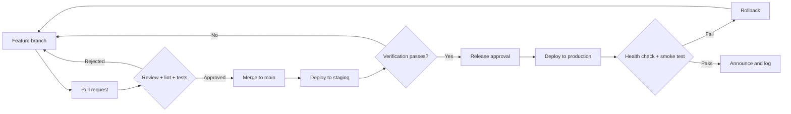

# Deployment Management and Contacts

**mysite — Edge Telemetry Dashboard**

How releases are planned, approved, executed, verified, and rolled back — and who to contact when something needs a decision.

> [!IMPORTANT]
> Placeholders written as `<TO BE COMPLETED>` must be filled in by the project owner before this document is treated as authoritative. Do not put passwords, secrets, or private keys in this file.

---

## Table of Contents

- [Environments](#environments)
- [Release Process](#release-process)
- [Deployment Runbooks](#deployment-runbooks)
- [Verification](#verification)
- [Rollback](#rollback)
- [Change Management](#change-management)
- [Credential Rotation](#credential-rotation)
- [Backup and Restore](#backup-and-restore)
- [Access Management](#access-management)
- [Monitoring and On-Call](#monitoring-and-on-call)
- [Maintenance Schedule](#maintenance-schedule)
- [Contacts and Escalation](#contacts-and-escalation)
- [Incident Communication](#incident-communication)
- [Deployment Log](#deployment-log)

---

## Environments

| Environment | Purpose | Host | Deployment method | Data source | Who may deploy |
| --- | --- | --- | --- | --- | --- |
| **Local** | Development | Developer workstation | `make setup`, `make dev` | ADX (read-only, via VPN) | Any developer |
| **Staging** | Pre-release verification | `<TO BE COMPLETED>` | `make deploy` | ADX (read-only) | Any developer |
| **Production** | Live operator use | AWS EC2, Ubuntu 22.04, private VPC | `make vm-deploy` or `make deploy` | ADX (read-only) | Release manager / platform owner only |

### Production facts

| Item | Value |
| --- | --- |
| Cloud provider | AWS EC2 |
| Region | `<TO BE COMPLETED>` |
| Instance ID | `<TO BE COMPLETED>` |
| Private IP | `<TO BE COMPLETED>` |
| Application path | `/opt/mysite` |
| Process manager | Supervisor (`mysite:*`) — or Docker Compose where containerised |
| Web server | Nginx (ports 80, 443) |
| Application server | Gunicorn (port 8000) |
| Database | PostgreSQL 15 |
| Cache | Redis 7 |
| Network access | `saturnvpnconfig` VPN only |
| TLS certificate | `<TO BE COMPLETED — issuer and expiry>` |

> Every environment reads ADX with a **read-only** service principal. No environment can write to field equipment.

---

## Release Process



### Release types

| Type | Trigger | Approval required | Window |
| --- | --- | --- | --- |
| **Standard** | Planned feature or fix | Release manager | Scheduled maintenance window |
| **Expedited** | S2 defect affecting users | Release manager | Same business day |
| **Emergency** | S1 outage or security fix | Platform owner (may be retrospective) | Immediate |

### Pre-deployment checklist

Complete every item before touching production.

- [ ] All changes merged to `main` and the branch is clean
- [ ] `make lint` passes with zero errors
- [ ] `make test` passes
- [ ] `make migrate-check` reports no unapplied model changes
- [ ] `make check-deploy` reports no production issues
- [ ] Verified on staging against a real device serial
- [ ] Database migrations reviewed for backward compatibility and reversibility
- [ ] New or changed environment variables added to `.env.example` **and** to the production `.env`
- [ ] `README.md` and `docs/SRS.md` updated where behaviour changed
- [ ] Rollback plan confirmed (see [Rollback](#rollback))
- [ ] Backup taken (`make backup`)
- [ ] Release manager has approved
- [ ] Users notified if downtime is expected

---

## Deployment Runbooks

### Runbook A — Production, bare VM with Supervisor

Executed from a VPN-connected workstation.

```bash
# 1. Take a backup first
ssh -i $SSH_KEY $PROD_HOST 'cd /opt/mysite && bash deploy/scripts/backup.sh'

# 2. Deploy (pull, install, migrate, collectstatic, build, restart)
make vm-deploy PROD_HOST=ubuntu@<ec2-private-ip> SSH_KEY=~/.ssh/mysite.pem

# 3. Verify
make vm-status
make health HEALTH_URL=http://<ec2-private-ip>/api/health/
```

Manual equivalent, if you need to run the steps individually:

```bash
ssh -i your-key.pem ubuntu@<ec2-private-ip>
cd /opt/mysite
git pull origin main
source venv/bin/activate
pip install -r backend/requirements.txt
cd backend && python manage.py migrate --noinput && python manage.py collectstatic --noinput
cd ../frontend && npm ci && npm run build
sudo supervisorctl restart mysite:*
```

### Runbook B — Production, Docker Compose

```bash
# On the host, from /opt/mysite
make backup
make deploy          # deploy.sh: pull -> build -> up -> health check -> prune
make ps
make health
```

`deploy/scripts/deploy.sh` performs its own post-deployment health check and aborts on failure. `entrypoint.sh` runs migrations and `collectstatic` automatically on container start.

### Runbook C — Staging

Identical to the production runbook for the target platform, pointed at the staging host. Always exercise the full runbook on staging so the production run is rehearsed rather than improvised.

### Runbook D — First-time host provisioning

```bash
bash deploy/scripts/setup-azure-vm.sh
```

Then follow the AWS EC2 section of [README.md](../README.md#aws-ec2-supervisor-no-docker) to install the Nginx and Supervisor configuration.

### Deployment windows

| Window | Time | Notes |
| --- | --- | --- |
| Standard | `<TO BE COMPLETED>` | Outside operator working hours |
| Emergency | Any time | Requires platform owner authorisation |

Avoid deploying on a Friday afternoon or immediately before a holiday unless it is an emergency fix.

---

## Verification

Run every check after each production deployment. A deployment is not complete until all pass.

| # | Check | Command or action | Pass criteria |
| --- | --- | --- | --- |
| 1 | Processes running | `make vm-status` / `make ps` | All processes `RUNNING` / `healthy` |
| 2 | Health endpoint | `make health` | HTTP 200, all `checks` are `ok` |
| 3 | Frontend loads | Open the dashboard in a browser | No console errors, correct build served |
| 4 | Authentication | Log in with a test account | Session established, `/api/auth/me/` returns 200 |
| 5 | Device lookup | Search a known serial | Device metadata renders |
| 6 | Telemetry | Observe the dashboard widgets | Charts populate with recent data |
| 7 | Events | Open the Events page | Events list and Pareto chart render |
| 8 | ADX cost path | `curl /api/adx_stats/` | Cache is being hit; query rate is nominal |
| 9 | Logs | `make vm-logs` / `make logs-backend` | No repeating errors or restart loop |
| 10 | Migrations | `make migrate-check` on the host | No pending changes |

If any check fails and cannot be corrected within 15 minutes, [roll back](#rollback).

---

## Rollback

### Decision criteria

Roll back immediately when any of the following is true:

- The health endpoint does not return 200 after 5 minutes.
- Users cannot log in.
- Telemetry is unavailable for all devices.
- A data-integrity defect is observed.
- The backend is in a restart loop.

Do **not** attempt a forward fix under outage conditions. Restore service first, diagnose afterwards.

### Rollback — bare VM

```bash
ssh -i your-key.pem ubuntu@<ec2-private-ip>
cd /opt/mysite

git log --oneline -10             # identify the last known-good commit
git checkout <last-good-sha>

source venv/bin/activate
pip install -r backend/requirements.txt
cd backend && python manage.py collectstatic --noinput
cd ../frontend && npm ci && npm run build
sudo supervisorctl restart mysite:*

curl -f http://localhost/api/health/
```

### Rollback — Docker

```bash
cd /opt/mysite
git checkout <last-good-sha>
docker compose up -d --build
make health
```

### Rolling back a database migration

Application code rolls back cleanly; migrations do not always.

```bash
cd backend
python manage.py showmigrations telemetryapp
python manage.py migrate telemetryapp <previous_migration_number>
```

> [!WARNING]
> Migrations that drop or rename columns are **not** reversible without data loss. Review every migration for reversibility during code review, and always take a backup before deploying one. If a destructive migration must be reverted, [restore from backup](#backup-and-restore) instead — and involve the database owner.

### Post-rollback actions

1. Confirm all ten verification checks pass on the restored version.
2. Notify users that service is restored.
3. Raise an issue capturing what failed and why it was not caught in staging.
4. Record the event in the [deployment log](#deployment-log).

---

## Change Management

| Change class | Examples | Approval | Notice to users |
| --- | --- | --- | --- |
| **Low** | Copy edits, styling, documentation | Peer review | None |
| **Medium** | New widget, new endpoint, dependency upgrade | Release manager | Release note |
| **High** | Schema migration, authentication change, infrastructure change | Platform owner | Advance notice + maintenance window |
| **Emergency** | Security patch, outage fix | Platform owner (may be retrospective) | Incident notification |

Every change must be traceable to a pull request. Direct commits to `main` and direct edits on the production host are prohibited — a host-side edit is silently overwritten by the next `git pull` and creates an undiagnosable divergence.

---

## Credential Rotation

| Credential | Location | Rotation cadence | Impact if expired |
| --- | --- | --- | --- |
| `ADX_CLIENT_SECRET` | Azure AD app registration | Before Azure expiry — **track this date** | **All telemetry stops.** Highest-risk credential in the system |
| `DJANGO_SECRET_KEY` | `.env` | On suspected compromise | Sessions and signed values invalidated |
| `JWT_SIGNING_KEY` | `.env` | On suspected compromise | All users logged out |
| `DB_PASSWORD` | `.env` + PostgreSQL | Annually | Backend cannot reach the database |
| TLS certificate | Host | Per issuer validity | Browser security warnings, then blocked access |
| SSH key | Workstation + host | Annually, and on team change | No deployment access |
| VPN profile | IT-managed | Per IT policy | No access at all |

### Rotating the ADX secret

```bash
# 1. Create a new client secret in the Azure AD app registration (portal)
# 2. Update .env on the host
ssh -i your-key.pem ubuntu@<ec2-private-ip>
cd /opt/mysite && nano .env          # set ADX_CLIENT_SECRET

# 3. Restart so the new value is read
sudo supervisorctl restart mysite:*  # or: docker compose up -d --force-recreate backend

# 4. Verify
curl -f http://localhost/api/health/  # expect "adx": "configured"
```

Then delete the old secret in Azure AD once the new one is confirmed working.

> Environment variables are read at process start. Editing `.env` without restarting changes nothing.

### Secret handling rules

- Secrets live only in `.env` on the host and in the approved secret store. Never in Git, issues, chat, screenshots, or this document.
- `.env` must be `chmod 600` and owned by the deployment user.
- Rotate immediately on any suspected exposure — do not wait for the scheduled cadence.
- Never reuse a secret across environments.

---

## Backup and Restore

### What is backed up

| Asset | Mechanism | Cadence | Retention |
| --- | --- | --- | --- |
| PostgreSQL database | `deploy/scripts/backup.sh` | `<TO BE COMPLETED — recommend daily>` | `<TO BE COMPLETED — recommend 30 days>` |
| Media files | `deploy/scripts/backup.sh` | Daily | 30 days |
| Application logs | `deploy/scripts/backup.sh` | Daily | 14 days |
| `.env` | Manual, to the approved secret store | On every change | Current + 1 previous |
| Source code | Git remote | Per commit | Indefinite |

Telemetry is **not** backed up by this system. It resides in ADX under the platform team's retention policy.

### Taking a backup

```bash
make backup
```

Always run this immediately before a deployment that includes a migration.

### Restoring

```bash
# Stop the application so nothing writes during the restore
sudo supervisorctl stop mysite:*        # or: docker compose stop backend

# Restore the database dump
psql -U mysite_user -d mysite_db < /path/to/backup.sql
# Docker: docker compose exec -T db psql -U mysite_user -d mysite_db < backup.sql

# Restart and verify
sudo supervisorctl start mysite:*
curl -f http://localhost/api/health/
```

> Restores must be rehearsed. An untested backup is not a backup — schedule a restore drill at least twice a year and record the outcome.

---

## Access Management

### Requesting access

| Access | Request from | Prerequisite |
| --- | --- | --- |
| VPN (`saturnvpnconfig`) | IT administrator | Manager approval |
| Application account | Application administrator | VPN access |
| `AdminGroup` membership | Platform owner | Documented need |
| Django admin | Platform owner | `AdminGroup` |
| SSH to the production host | Platform owner | Named on the deployment rota |
| AWS console | Cloud team | Manager approval |
| Azure AD / ADX | Data platform team | Manager approval |

### Granting an application account

```bash
# Create the user
python manage.py createsuperuser        # admin
# or via the Django admin for a standard operator account

# Grant diagnostic access
# Django admin -> Users -> select user -> Groups -> add "AdminGroup"
```

### Offboarding

Complete every step on the user's last day.

- [ ] Deactivate the application account (do not delete — it preserves audit history)
- [ ] Remove from `AdminGroup`
- [ ] Revoke the VPN profile (IT)
- [ ] Remove the SSH public key from the production host
- [ ] Revoke AWS and Azure access
- [ ] Rotate any shared credential the person had access to

### Access review

Review all accounts, group memberships, and host SSH keys quarterly. Record the review date and reviewer.

---

## Monitoring and On-Call

### What to watch

| Signal | Source | Threshold | Action |
| --- | --- | --- | --- |
| Service availability | `GET /api/health/` | Non-200 for 2 consecutive checks | Page on-call |
| Dependency health | `checks` object in the health response | Any check not `ok` | Investigate the named dependency |
| ADX cache hit ratio | `GET /api/adx_stats/` | Below 60 % | Review TTLs and Redis connectivity |
| ADX query volume | `GET /api/adx_stats/` + Azure cost view | Sustained increase | Investigate refresh intervals and cost |
| Disk usage | Host | Above 80 % | Clear logs and old backups |
| Error rate | Application and Nginx logs | Repeating 5xx | Investigate immediately |
| Azure AD secret expiry | Azure portal | 30 days remaining | [Rotate](#credential-rotation) |
| TLS certificate expiry | Host | 30 days remaining | Renew |

### Recommended probe

```
GET http://<host>/api/health/    every 60s    expect 200
```

Configured monitoring endpoint: `<TO BE COMPLETED>`

### On-call

| Item | Value |
| --- | --- |
| Rota | `<TO BE COMPLETED>` |
| Hours of coverage | `<TO BE COMPLETED>` |
| Paging channel | `<TO BE COMPLETED>` |
| Escalation after no response | 15 minutes, then the next tier below |

On-call responsibilities: acknowledge within the target first-response time, restore service (rollback is always acceptable), communicate status, and hand over a written summary.

---

## Maintenance Schedule

| Task | Cadence | Owner |
| --- | --- | --- |
| Verify backups completed | Weekly | Platform operator |
| Review error logs | Weekly | Backend maintainer |
| Review ADX cost and cache metrics | Monthly | Platform owner |
| Dependency vulnerability scan (`make security-check`) | Monthly | Backend maintainer |
| Dependency updates (`make outdated`) | Quarterly | Development team |
| OS security patches | Monthly | Platform operator |
| Access review | Quarterly | Platform owner |
| Restore drill | Twice yearly | Platform operator |
| Credential expiry review | Quarterly | Platform owner |
| Documentation review (README, SRS, this document) | Quarterly | Project owner |

---

## Contacts and Escalation

> Complete this section before relying on it during an incident. An incomplete contact table is itself an outage risk.

### Roles

| Role | Responsibility | Name | Contact | Backup |
| --- | --- | --- | --- | --- |
| **Project owner** | Scope, priorities, final decisions | `<TO BE COMPLETED>` | `<TO BE COMPLETED>` | `<TO BE COMPLETED>` |
| **Platform owner** | Production authority, approves emergency changes and rollbacks | `<TO BE COMPLETED>` | `<TO BE COMPLETED>` | `<TO BE COMPLETED>` |
| **Release manager** | Approves and executes standard releases | `<TO BE COMPLETED>` | `<TO BE COMPLETED>` | `<TO BE COMPLETED>` |
| **Backend maintainer** | Django API, ADX integration | `<TO BE COMPLETED>` | `<TO BE COMPLETED>` | `<TO BE COMPLETED>` |
| **Frontend maintainer** | React SPA, widgets, design system | `<TO BE COMPLETED>` | `<TO BE COMPLETED>` | `<TO BE COMPLETED>` |
| **Platform operator (SRE)** | Host, Nginx, Gunicorn, backups, monitoring | `<TO BE COMPLETED>` | `<TO BE COMPLETED>` | `<TO BE COMPLETED>` |
| **Application administrator** | User accounts and group membership | `<TO BE COMPLETED>` | `<TO BE COMPLETED>` | `<TO BE COMPLETED>` |

### External and partner teams

| Team | Owns | Contact | Contact when |
| --- | --- | --- | --- |
| **IT / Network** | `saturnvpnconfig` VPN | `<TO BE COMPLETED>` | VPN cannot connect, or drops repeatedly |
| **Cloud team** | AWS EC2, VPC, security groups | `<TO BE COMPLETED>` | Instance down, network or firewall change needed |
| **Data platform team** | Azure Data Explorer, ingestion pipeline | `<TO BE COMPLETED>` | ADX outage, schema change, missing device data, cost review |
| **Azure AD administrators** | Service principal, tenant | `<TO BE COMPLETED>` | Secret rotation, permission grants |
| **Field service** | Physical devices | `<TO BE COMPLETED>` | A device is not reporting at all |
| **Security team** | Vulnerabilities, incident response | `<TO BE COMPLETED>` | Suspected breach or credential exposure |

### Escalation path by symptom

| Symptom | First | Then | Finally |
| --- | --- | --- | --- |
| Cannot connect to VPN | IT / Network | Platform owner | — |
| Dashboard down for everyone | Platform operator | Platform owner | Project owner |
| Login broken | Backend maintainer | Platform operator | Platform owner |
| No telemetry for any device | Backend maintainer | Data platform team | Platform owner |
| No telemetry for one device | Field service | Data platform team | — |
| Widget wrong or missing signal | Frontend maintainer | Backend maintainer | — |
| ADX authentication failing | Backend maintainer | Azure AD administrators | Platform owner |
| ADX cost spike | Platform owner | Data platform team | Project owner |
| Suspected security incident | **Security team immediately** | Platform owner | Project owner |
| Deployment failed | Release manager | Platform operator | Platform owner |

### Escalation rules

1. Try the [Troubleshooting Guide](TROUBLESHOOTING.md) first for S3 and S4 issues.
2. For S1 and S2, escalate **in parallel** with troubleshooting — do not wait until you are out of ideas.
3. Always escalate immediately, without attempting a fix, for: suspected security incidents, anything requiring credential rotation, anything requiring a database restore, and anything requiring infrastructure changes.
4. If the primary contact does not respond within 15 minutes, go to the backup, then to the next tier.

---

## Incident Communication

### During an incident

| Audience | Channel | Frequency |
| --- | --- | --- |
| Affected users | `<TO BE COMPLETED>` | On detection, then every 30 minutes |
| Engineering team | `<TO BE COMPLETED>` | Continuous |
| Management | `<TO BE COMPLETED>` | On detection (S1 only), then hourly |

### Notification template

```
[<SEVERITY>] mysite - <short description>

Status:      Investigating | Identified | Monitoring | Resolved
Started:     <timestamp and timezone>
Impact:      <who is affected and what they cannot do>
Cause:       <known cause, or "under investigation">
Workaround:  <if any, or "none">
Next update: <timestamp>
Owner:       <name>
```

### After an incident

For every S1 and S2, produce a post-incident review within five working days covering: timeline, root cause, why it was not caught earlier, corrective actions with owners and dates, and any documentation that needs updating. Reviews are blameless — they examine the system, not the individual.

---

## Deployment Log

Record every production deployment. This is the first thing anyone reads when diagnosing "it worked yesterday".

| Date | Version / commit | Type | Deployed by | Migrations? | Verification | Rollback? | Notes |
| --- | --- | --- | --- | --- | --- | --- | --- |
| `<YYYY-MM-DD>` | `<sha>` | Standard | `<name>` | No | Pass | No | |

---

## Related Documents

| Document | Purpose |
| --- | --- |
| [README](../README.md) | Architecture, setup, API reference, deployment steps |
| [Troubleshooting Guide](TROUBLESHOOTING.md) | Symptom-driven diagnosis |
| [VPN Access](VPN_ACCESS.md) | `saturnvpnconfig` onboarding |
| [SRS](SRS.md) | Requirements, verification, known gaps |
| [Deployment configuration](../deploy/README.md) | Nginx, Gunicorn, Supervisor reference |
| [Makefile](../Makefile) | Every supported command |
