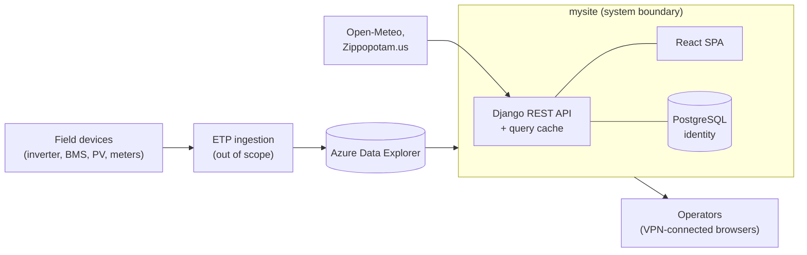
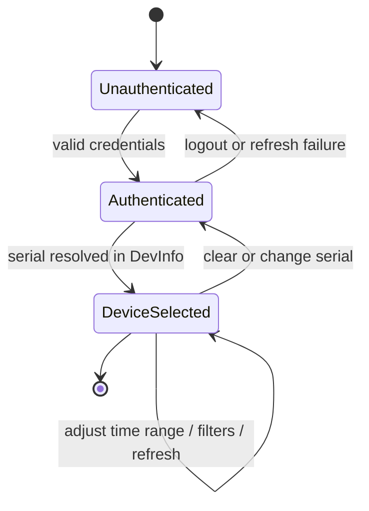

# Software Requirements Specification

## mysite — Edge Telemetry Dashboard

| Field | Value |
| --- | --- |
| Document ID | SRS-MYSITE-001 |
| Version | 1.0 |
| Status | Baselined |
| Date | 2026-09-03 |
| Standard | ISO/IEC/IEEE 29148:2018 |
| Applies to | mysite v1.x (Django 5.2 backend, React 19 frontend) |
| Classification | Proprietary — internal use only |

### Revision history

| Version | Date | Author | Description |
| --- | --- | --- | --- |
| 1.0 | 2026-09-03 | Engineering | Initial baseline reconstructed from the implemented system. Supersedes ad-hoc documentation in `docs/PROJECT_ARCHITECTURE.md`. |

---

## Table of Contents

1. [Introduction](#1-introduction)
2. [Overall Description](#2-overall-description)
3. [External Interface Requirements](#3-external-interface-requirements)
4. [Functional Requirements](#4-functional-requirements)
5. [Non-Functional Requirements](#5-non-functional-requirements)
6. [Data Requirements](#6-data-requirements)
7. [Design and Implementation Constraints](#7-design-and-implementation-constraints)
8. [Verification](#8-verification)
9. [Assumptions and Dependencies](#9-assumptions-and-dependencies)
10. [Known Gaps and Planned Work](#10-known-gaps-and-planned-work)
11. [Appendices](#11-appendices)

---

## 1. Introduction

### 1.1 Purpose

This document specifies the functional and non-functional requirements for **mysite**, a web-based telemetry monitoring dashboard for distributed energy resource (DER) installations. It is the authoritative reference for development, verification, and change control.

Intended readership:

| Audience | Use |
| --- | --- |
| Developers | Implementation contract; source of acceptance criteria |
| QA engineers | Basis for test case derivation and traceability |
| DevOps / SRE | Deployment, availability, and operational requirements |
| Product owners | Scope confirmation and change approval |
| Field service engineers | Understanding of supported diagnostic capability |

### 1.2 Scope

**mysite** provides authenticated operators with near-real-time and historical visibility into a single DER installation identified by its communications serial number (`comms_serial`).

**In scope**

- Authentication, session management, and role-based access control.
- Device lookup and metadata display by serial number.
- Live and historical visualisation of photovoltaic, grid, load, and battery telemetry.
- Alarm and event retrieval, filtering, and Pareto/frequency analysis.
- Site-local timezone resolution and weather correlation.
- Data export (per-widget CSV, full-dashboard PDF).
- Operational health reporting and Azure Data Explorer (ADX) cost governance.

**Out of scope**

- Device control, command dispatch, or configuration write-back. The system is strictly read-only with respect to field equipment.
- Telemetry ingestion. Data arrives in ADX through an upstream pipeline outside this system's boundary.
- Firmware distribution or over-the-air update execution (the Firmware page is informational only).
- Alarm notification delivery (email, SMS, push).
- Multi-device fleet comparison in a single view.
- Billing, tariff, or financial modelling.

### 1.3 Definitions, acronyms, and abbreviations

| Term | Definition |
| --- | --- |
| **ADX** | Azure Data Explorer — the managed time-series store holding all field telemetry |
| **Alarm** | A discrete event record with a binary `value` (`1` = active, `0` = cleared) |
| **BGCS** | Backup Grid Connection Switch — the grid isolation relay assembly |
| **BMS** | Battery Management System |
| **`comms_serial`** | Unique communications serial number identifying a device installation |
| **DER** | Distributed Energy Resource |
| **ETP** | Edge Telemetry Pipeline — the upstream data ingestion service |
| **Fast mode** | Telemetry sampling at 15-second resolution |
| **INV** | Inverter |
| **JWT** | JSON Web Token |
| **KQL** | Kusto Query Language, used to query ADX |
| **Normal mode** | Telemetry sampling at 15-minute aggregated resolution |
| **Pareto chart** | Bar chart of event frequency with a cumulative-percentage line overlay |
| **PV** | Photovoltaic (solar) input channel |
| **SoC** | State of Charge (battery, %) |
| **SP** | Azure AD Service Principal |
| **SPA** | Single Page Application |
| **Widget** | A self-contained dashboard card rendering one telemetry signal |

### 1.4 Requirement conventions

Requirements use the identifier scheme `<CATEGORY>-<NNN>`:

| Prefix | Category |
| --- | --- |
| `FR` | Functional requirement |
| `NFR` | Non-functional requirement |
| `DR` | Data requirement |
| `IR` | Interface requirement |
| `CON` | Constraint |

Priority levels follow MoSCoW: **M** (Must), **S** (Should), **C** (Could), **W** (Won't, this release).

The key words *shall*, *should*, and *may* are to be interpreted as described in ISO/IEC/IEEE 29148:2018. *Shall* denotes a binding requirement.

### 1.5 References

| Ref | Document |
| --- | --- |
| [R1] | ISO/IEC/IEEE 29148:2018 — Requirements engineering |
| [R2] | OWASP Top 10 (2021) |
| [R3] | WCAG 2.1 Level AA |
| [R4] | `README.md` — architecture and operations overview |
| [R5] | `docs/VPN_ACCESS.md` — network access procedure |
| [R6] | `docs/DASHBOARD_REDESIGN_COMPLETE.md` — visual design system |
| [R7] | Azure Data Explorer service documentation |
| [R8] | RFC 7519 — JSON Web Token |

---

## 2. Overall Description

### 2.1 Product perspective

mysite is a **downstream consumer** in a larger DER telemetry ecosystem. It owns no field data; it authenticates users, queries ADX on their behalf, and renders the results.

System boundary: everything inside `SYS`. The ingestion pipeline, ADX itself, the VPN concentrator, and the field devices are external dependencies.

### 2.2 User classes and characteristics

| ID | User class | Characteristics | Privileges |
| --- | --- | --- | --- |
| UC-1 | **Operator** | Primary user. Monitors installations daily. Domain-literate, not technical. | Authenticate; view all dashboard, event, history, and firmware pages; export data |
| UC-2 | **Field service engineer** | Diagnoses faults on-site or remotely. Reads raw signal paths and alarm codes. | As UC-1, plus fast-mode sampling and raw event inspection |
| UC-3 | **Administrator** | Member of the Django `AdminGroup`. Manages accounts and diagnoses platform issues. | As UC-2, plus Django admin and ADX diagnostic endpoints |
| UC-4 | **Platform operator (SRE)** | Deploys and monitors the service. | Infrastructure access; health and cost-metric endpoints |

### 2.3 Operating environment

| Element | Requirement |
| --- | --- |
| Client | Evergreen desktop browser (Chrome, Edge, Firefox, Safari) with ES2020 and CSS custom-property support; minimum viewport 1280 × 800 |
| Network | Active `saturnvpnconfig` VPN session |
| Server OS | Ubuntu 22.04 LTS on AWS EC2 |
| Runtime | Python 3.11, Node.js 20 (build only) |
| Data store | PostgreSQL 15 (identity), Redis 7 (cache), Azure Data Explorer (telemetry) |
| Web tier | Nginx reverse proxy, Gunicorn (`gthread`) WSGI server |

### 2.4 Operational concept

A session is meaningless without a selected device. All telemetry, event, and export capability is gated on a successfully resolved `comms_serial`.

---

## 3. External Interface Requirements

### 3.1 User interfaces

| ID | Requirement | Priority |
| --- | --- | --- |
| IR-001 | The system shall present a single-page web application with client-side routing across the Dashboard, Events, History, Firmware, Settings, and About views. | M |
| IR-002 | The system shall provide persistent global navigation exposing the current device serial, the global time range control, the theme toggle, and the logout action on every authenticated view. | M |
| IR-003 | The system shall support dark and light themes, defaulting to dark, with the selection persisted in browser local storage across sessions. | M |
| IR-004 | All colours, spacing, and typography shall derive from the design-token set defined in [R6]; components shall not hard-code colour values. | M |
| IR-005 | Every data-bearing component shall render distinct loading, empty, error, and populated states. | M |
| IR-006 | Numeric readouts shall use tabular figures so digits do not shift horizontally when values update. | S |
| IR-007 | The interface shall meet WCAG 2.1 Level AA contrast ratios in both themes, and shall not convey status by colour alone. | S |
| IR-008 | The system shall provide a print/PDF-optimised rendering of the dashboard. | S |
| IR-009 | The layout shall remain usable at tablet viewport widths (≥ 768 px). | C |

### 3.2 Software interfaces

#### IR-010 — Azure Data Explorer

| Attribute | Specification |
| --- | --- |
| Protocol | HTTPS, Kusto client SDK (`azure-kusto-data` 5.0.3) |
| Authentication | Azure AD service principal, application-key flow (`ADX_CLIENT_ID`, `ADX_CLIENT_SECRET`, `ADX_TENANT_ID`) |
| Authorisation | Read-only (`Viewer`) on the target database |
| Tables consumed | `DevInfo`, `Telemetry`, `Alarms` |
| Query language | KQL, constructed server-side |
| Direction | Read-only. The system shall never write to ADX. |

#### IR-011 — Weather and geolocation

| Service | Endpoint use | Failure behaviour |
| --- | --- | --- |
| Zippopotam.us | ZIP code → place name, latitude, longitude | Degrade gracefully; core telemetry unaffected |
| Open-Meteo | Coordinates + date range → hourly weather series | Degrade gracefully; weather card shows an error state |

#### IR-012 — Relational database

PostgreSQL 15 in production (SQLite permitted for local development only), accessed exclusively through the Django ORM with `CONN_MAX_AGE=60` connection reuse.

#### IR-013 — Cache

Redis 7 in production, in-process local memory in development, accessed through the Django cache framework. The cache shall be treated as volatile; loss of cache contents shall not cause functional failure.

### 3.3 Communication interfaces

| ID | Requirement | Priority |
| --- | --- | --- |
| IR-014 | The client shall communicate with the server over HTTPS using a JSON REST API rooted at `/api/`. | M |
| IR-015 | Authentication credentials shall be transported as `httpOnly` cookies; the client shall send them automatically via `withCredentials`. | M |
| IR-016 | The API shall accept `Authorization: Bearer <token>` as an alternative scheme for programmatic clients. | S |
| IR-017 | The server shall enforce an explicit CORS origin allowlist; wildcard origins shall be rejected when `DJANGO_ENVIRONMENT=production`. | M |
| IR-018 | Nginx shall reject request bodies exceeding 10 MB. | M |

---

## 4. Functional Requirements

### 4.1 Authentication and session management

| ID | Requirement | Priority |
| --- | --- | --- |
| FR-001 | The system shall allow a visitor to register an account with a username and password. | M |
| FR-002 | The system shall authenticate a user against stored credentials and, on success, issue an access token and a refresh token as `httpOnly` cookies. | M |
| FR-003 | Access tokens shall expire 120 minutes after issue; refresh tokens shall expire 5 days after issue. | M |
| FR-004 | The system shall rotate the refresh token on every successful refresh. | M |
| FR-005 | The client shall transparently attempt a token refresh on receiving HTTP 401 and shall retry the original request once on success. | M |
| FR-006 | Where a refresh fails, the system shall clear the client authentication state and redirect the user to the login view. | M |
| FR-007 | Logout shall clear both authentication cookies. | M |
| FR-008 | The system shall expose an endpoint returning the authenticated user's identity for session validation on application load. | M |
| FR-009 | The system shall deny access to all views other than login and register when no valid session exists. | M |
| FR-010 | The system shall restrict ADX diagnostic endpoints to users in the `AdminGroup`. | M |
| FR-011 | Passwords shall be stored using Django's configured password hashers; plaintext or reversibly encrypted storage is prohibited. | M |

### 4.2 Device selection

| ID | Requirement | Priority |
| --- | --- | --- |
| FR-020 | The system shall allow a user to search for a device by `comms_serial`. | M |
| FR-021 | The system shall resolve the serial against the ADX `DevInfo` table and return HTTP 404 where no match exists. | M |
| FR-022 | On successful resolution, the system shall display device metadata including serial, MAC address, firmware version, model, and last-seen timestamp. | M |
| FR-023 | The resolved serial shall be held in shared application state and shall scope every subsequent telemetry, alarm, and export request. | M |
| FR-024 | The system shall suppress all telemetry requests while no serial is selected. | M |
| FR-025 | Changing the selected serial shall invalidate and refetch all displayed data. | M |
| FR-026 | The system shall validate the serial against an expected format before incorporating it into a KQL query. | M |

### 4.3 Telemetry visualisation

| ID | Requirement | Priority |
| --- | --- | --- |
| FR-030 | The system shall render time-series charts for PV voltage and current across 4 channels. | M |
| FR-031 | The system shall render time-series charts for grid voltage (L1, L2), grid current (L1, L2), and grid frequency. | M |
| FR-032 | The system shall render time-series charts for load voltage (L1, L2), load current (L1, L2), and load frequency. | M |
| FR-033 | The system shall render voltage, temperature, state of charge, and current for each of 3 battery modules. | M |
| FR-034 | The system shall render Wi-Fi and cellular signal strength in dBm. | M |
| FR-035 | The system shall render discrete-state indicators for inverter operating state, ETP connection status, and BGCS grid relay position, mapping numeric codes to human-readable labels. | M |
| FR-036 | Each time-series widget shall offer a user-selectable toggle between normal (15-minute) and fast (15-second) sampling resolution. | M |
| FR-037 | Each time-series widget shall display summary statistics for the visible window: minimum, maximum, mean, and standard deviation. | S |
| FR-038 | The system shall present instantaneous values through animated analog gauges, including a dedicated battery state-of-charge gauge. | S |
| FR-039 | The system shall present an energy flow diagram illustrating power direction between PV, grid, battery, and load. | S |
| FR-040 | The system shall downsample series exceeding the renderable point budget while preserving visible minima and maxima. | S |
| FR-041 | Widgets shall be loaded in staggered groups on dashboard initialisation to bound concurrent load on ADX. | M |

### 4.4 Time range and refresh control

| ID | Requirement | Priority |
| --- | --- | --- |
| FR-050 | The system shall provide a global time-range control offering 7 presets spanning 15 minutes to 7 days. | M |
| FR-051 | The system shall provide a custom absolute start/end date-time picker. | M |
| FR-052 | A change to the global time range shall propagate to every subscribed widget and trigger a refetch. | M |
| FR-053 | Individual widgets shall be able to override the global range with a local range. | S |
| FR-054 | The system shall offer configurable auto-refresh at Off, 5 s, 10 s, 30 s, 1 min, and 5 min intervals. | M |
| FR-055 | The default auto-refresh interval shall be 5 minutes to limit ADX query volume. | M |
| FR-056 | The system shall suspend auto-refresh while the browser tab is not visible. | S |

### 4.5 Events and alarms

| ID | Requirement | Priority |
| --- | --- | --- |
| FR-060 | The system shall retrieve alarm and event records for the selected device and time range from the ADX `Alarms` table. | M |
| FR-061 | The system shall present events in a table showing timestamp, event name, and output value. | M |
| FR-062 | The system shall derive a severity classification of Critical, Warning, or Info from the event name path. | M |
| FR-063 | The system shall allow filtering by severity. | M |
| FR-064 | The system shall allow filtering by output state: Active (`1`), Inactive (`0`), or All. | M |
| FR-065 | The system shall allow free-text search across event names. | M |
| FR-066 | The system shall render a Pareto chart of event frequency with a cumulative-percentage overlay. | M |
| FR-067 | The system shall render a ranked bar chart of the most frequent events. | M |
| FR-068 | The system shall limit the default table rendering to 500 rows, with a user-initiated expansion to a hard ceiling of 20 000 rows. | M |
| FR-069 | Applied filters shall be reflected consistently in the table, the bar chart, and the Pareto chart. | M |

### 4.6 Site context

| ID | Requirement | Priority |
| --- | --- | --- |
| FR-070 | The system shall resolve a ZIP code and country to a location, IANA timezone identifier, and UTC offset. | S |
| FR-071 | The system shall allow the user to select a display timezone; all timestamps in tables and charts shall render in that timezone. | M |
| FR-072 | The system shall retrieve hourly weather data for the site location and selected date range. | C |
| FR-073 | Failure of any external weather or geolocation service shall not impair telemetry or event functionality. | M |

### 4.7 Export and reporting

| ID | Requirement | Priority |
| --- | --- | --- |
| FR-080 | Each time-series widget shall offer CSV export of its currently displayed data. | M |
| FR-081 | The system shall offer PDF export of the dashboard, preserving chart rendering and the active theme. | S |
| FR-082 | Exported files shall include the device serial and the time range in the filename or header. | S |

### 4.8 Query optimisation and cost governance

| ID | Requirement | Priority |
| --- | --- | --- |
| FR-090 | The system shall provide a batch endpoint that retrieves the latest values for multiple telemetry signals and alarms in a single ADX query. | M |
| FR-091 | The system shall cache ADX query results server-side, keyed by a hash of the query text. | M |
| FR-092 | Cache lifetime shall be configurable, defaulting to 30 seconds for live queries and 300 seconds for historical queries. | M |
| FR-093 | The system shall enforce a configurable per-process query rate limit, defaulting to 60 queries per minute. | M |
| FR-094 | The system shall reuse a single pooled ADX client instance across requests in a thread-safe manner. | M |
| FR-095 | The system shall expose cache hit/miss counts and rate-limiter state through a statistics endpoint. | S |
| FR-096 | Where a rate limit is exceeded, the system shall return a clear, actionable error rather than failing silently. | M |

### 4.9 Administration and operations

| ID | Requirement | Priority |
| --- | --- | --- |
| FR-100 | The system shall expose an unauthenticated health endpoint reporting per-dependency status for the database, cache, and ADX configuration. | M |
| FR-101 | The health endpoint shall return HTTP 200 when all checks pass and HTTP 503 when any check fails. | M |
| FR-102 | The system shall provide a Django administration interface for user and group management. | M |
| FR-103 | The system shall provide CRUD endpoints for locally stored telemetry records. | S |
| FR-104 | The system shall validate `DJANGO_SECRET_KEY`, `DJANGO_DEBUG`, and `DJANGO_ALLOWED_HOSTS` at startup when running in production mode and shall refuse to start on violation. | M |
| FR-105 | The system shall emit structured application logs at a configurable severity level. | M |

---

## 5. Non-Functional Requirements

### 5.1 Performance

| ID | Requirement | Target | Priority |
| --- | --- | --- | --- |
| NFR-001 | SPA first contentful paint on a warm cache | ≤ 2.0 s | S |
| NFR-002 | Authentication endpoint response time (p95) | ≤ 500 ms | M |
| NFR-003 | Device lookup response time (p95, cache miss) | ≤ 3.0 s | M |
| NFR-004 | Batch telemetry response time (p95, cache hit) | ≤ 200 ms | M |
| NFR-005 | Batch telemetry response time (p95, cache miss) | ≤ 5.0 s | M |
| NFR-006 | Dashboard fully populated after serial selection | ≤ 10 s | S |
| NFR-007 | Chart re-render on a time-range change | ≤ 500 ms | S |
| NFR-008 | Concurrent authenticated users supported without degradation | ≥ 25 | S |
| NFR-009 | Cache hit ratio for ADX queries under steady-state dashboard use | ≥ 60 % | S |

### 5.2 Security

| ID | Requirement | Priority |
| --- | --- | --- |
| NFR-010 | All authentication tokens shall be stored in `httpOnly` cookies and shall be unreadable by client-side JavaScript. | M |
| NFR-011 | All traffic shall be served over TLS in production; HTTP requests shall be redirected to HTTPS. | M |
| NFR-012 | HTTP Strict Transport Security shall be enabled with a minimum `max-age` of one year. | M |
| NFR-013 | Responses shall set `X-Frame-Options: DENY`, `X-Content-Type-Options: nosniff`, and `Referrer-Policy: strict-origin-when-cross-origin`. | M |
| NFR-014 | Secrets shall be supplied exclusively through environment variables and shall never be committed to version control. | M |
| NFR-015 | The ADX service principal shall hold read-only permissions and no more than the minimum required scope. | M |
| NFR-016 | Application containers shall execute as a non-root user. | M |
| NFR-017 | The system shall not expose stack traces, framework versions, or configuration values in production error responses. | M |
| NFR-018 | All user-supplied values incorporated into KQL shall be validated or parameterised to prevent query injection. | M |
| NFR-019 | The system shall address the OWASP Top 10 (2021) risk categories; deviations shall be documented in [Section 10](#10-known-gaps-and-planned-work). | M |
| NFR-020 | Dependencies shall be pinned to explicit versions and reviewed for known vulnerabilities at least quarterly. | S |
| NFR-021 | Network access shall be restricted to VPN-connected clients. | M |

### 5.3 Reliability and availability

| ID | Requirement | Priority |
| --- | --- | --- |
| NFR-030 | The service shall achieve 99.0 % monthly availability during business hours, excluding VPN and ADX outages. | S |
| NFR-031 | Failure of a single widget's data fetch shall not prevent other widgets from rendering. | M |
| NFR-032 | Unavailability of Redis shall degrade the system to uncached operation rather than causing failure. | M |
| NFR-033 | Application processes shall restart automatically on unexpected termination. | M |
| NFR-034 | Container orchestration shall not start the application tier until database and cache health checks pass. | M |
| NFR-035 | Gunicorn workers shall recycle after 1 000 requests to bound memory growth. | S |
| NFR-036 | Database, media, and log backups shall be executable on a scheduled basis. | S |

### 5.4 Usability

| ID | Requirement | Priority |
| --- | --- | --- |
| NFR-040 | Error messages shall state the cause and the corrective action in plain language, without exposing internal identifiers. | M |
| NFR-041 | Any operation exceeding 300 ms shall present a loading indicator. | M |
| NFR-042 | User preferences for theme, refresh interval, and timezone shall persist across sessions. | S |
| NFR-043 | Physical quantities shall always be displayed with their units. | M |
| NFR-044 | Interactive elements shall be keyboard-reachable and expose accessible names. | S |

### 5.5 Maintainability

| ID | Requirement | Priority |
| --- | --- | --- |
| NFR-050 | Frontend source shall be written in TypeScript, with new modules avoiding untyped JavaScript. | S |
| NFR-051 | Time-series widgets shall be composed from a shared base component and a declarative configuration entry; bespoke chart implementations are prohibited without justification. | M |
| NFR-052 | KQL construction shall be centralised in a single builder module. | M |
| NFR-053 | The frontend shall pass ESLint with zero errors before merge. | M |
| NFR-054 | Configuration shall be externalised to environment variables; no environment-specific values shall be hard-coded. | M |
| NFR-055 | Architectural or behavioural changes shall be accompanied by an update to this specification and to `README.md`. | M |

### 5.6 Portability and deployability

| ID | Requirement | Priority |
| --- | --- | --- |
| NFR-060 | The system shall be deployable via Docker Compose and via a Supervisor-managed installation on a bare virtual machine. | M |
| NFR-061 | Database migrations and static-file collection shall execute automatically on container startup. | M |
| NFR-062 | Deployment shall be gated by an automated post-deployment health check. | M |
| NFR-063 | The system shall support SQLite for local development without code changes. | S |

### 5.7 Observability

| ID | Requirement | Priority |
| --- | --- | --- |
| NFR-070 | Application, Gunicorn, and Nginx logs shall be written to standard streams for collection by the host log driver. | M |
| NFR-071 | The health endpoint shall be suitable for automated liveness and readiness probing. | M |
| NFR-072 | ADX query volume and cache effectiveness shall be observable at runtime for cost management. | M |

---

## 6. Data Requirements

### 6.1 External telemetry schema (ADX, read-only)

| Table | Column | Type | Description |
| --- | --- | --- | --- |
| `DevInfo` | `comms_serial` | string | Device identifier (lookup key) |
| `DevInfo` | *metadata* | mixed | Model, firmware, MAC address, last-seen timestamp |
| `Telemetry` | `comms_serial` | string | Device identifier |
| `Telemetry` | `name` | string | Hierarchical signal path, e.g. `/INV/DCPORT/STAT/PV1/V` |
| `Telemetry` | `value_double` | real | Measured value |
| `Telemetry` | `localtime` | datetime | Site-local sample timestamp |
| `Alarms` | `comms_serial` | string | Device identifier |
| `Alarms` | `name` | string | Event path, e.g. `/BMS/CLUSTER/EVENT/ALARM/MAIN_RELAY_ERROR` |
| `Alarms` | `value` | int | `1` = active, `0` = cleared |
| `Alarms` | `localtime` | datetime | Site-local event timestamp |

| ID | Requirement | Priority |
| --- | --- | --- |
| DR-001 | The system shall treat ADX as authoritative and read-only for all telemetry and alarm data. | M |
| DR-002 | The system shall not persist bulk telemetry retrieved from ADX beyond the configured cache lifetime. | M |
| DR-003 | The system shall tolerate absent or null signals for a device without raising a user-facing error. | M |

### 6.2 Local relational schema

| Entity | Purpose | Key attributes |
| --- | --- | --- |
| `User` (Django built-in) | Identity and authentication | `username`, hashed `password`, `email`, group membership |
| `Group` (Django built-in) | Role assignment | `AdminGroup` grants diagnostic access |
| `Telemetry` | Local staging/reference record | Inverter grid L1/L2 RMS voltage, L1 RMS current, BGCS relay status, ETP container status, Wi-Fi signal strength, Wi-Fi frequency band, `created_at` |

| ID | Requirement | Priority |
| --- | --- | --- |
| DR-010 | Schema changes shall be applied exclusively through Django migrations. | M |
| DR-011 | Production shall use PostgreSQL; SQLite is permitted only for local development. | M |
| DR-012 | Passwords shall never be stored, logged, or transmitted in reversible form. | M |

### 6.3 Retention

| ID | Requirement | Priority |
| --- | --- | --- |
| DR-020 | Telemetry retention is governed by the ADX retention policy and is outside this system's control. | M |
| DR-021 | Cached query results shall expire automatically within their configured TTL. | M |
| DR-022 | Application logs shall be rotated with a bounded size and retained copy count. | S |

---

## 7. Design and Implementation Constraints

| ID | Constraint | Rationale |
| --- | --- | --- |
| CON-001 | Backend implemented in Python 3.11 with Django 5.2 and Django REST Framework. | Existing platform standard and team skill set |
| CON-002 | Frontend implemented in React 19 with TypeScript and built by Vite. | Existing codebase and component library |
| CON-003 | Azure Data Explorer is the only permitted telemetry source. | Enterprise data platform mandate |
| CON-004 | The system shall be read-only with respect to field equipment. | Safety: no control path from the monitoring plane |
| CON-005 | All access shall traverse the `saturnvpnconfig` VPN. | Corporate network security policy |
| CON-006 | Hosting is on AWS EC2 within a private VPC. | Existing infrastructure agreement |
| CON-007 | ADX is billed per query, constraining refresh frequency and mandating caching. | Operating cost control |
| CON-008 | Authentication uses JWT in `httpOnly` cookies rather than local storage. | XSS mitigation |
| CON-009 | Global state is managed with the React Context API; Redux and equivalent stores are excluded. | Complexity budget |
| CON-010 | Theming is implemented with CSS custom properties. | Instant theme switching without re-render cascades |

---

## 8. Verification

### 8.1 Verification methods

| Code | Method | Application |
| --- | --- | --- |
| **T** | Test | Automated unit, integration, or end-to-end test |
| **D** | Demonstration | Operating the system and observing behaviour |
| **I** | Inspection | Code, configuration, or document review |
| **A** | Analysis | Measurement, profiling, or modelling |

### 8.2 Verification matrix

| Requirement group | Method | Evidence |
| --- | --- | --- |
| FR-001 – FR-011 (authentication) | T | API tests covering register, login, refresh rotation, logout, and unauthorised access |
| FR-020 – FR-026 (device selection) | T, D | Integration test against a known serial and a non-existent serial |
| FR-030 – FR-041 (visualisation) | D, I | Manual walkthrough per widget group; review of `widgetConfigs.ts` coverage |
| FR-050 – FR-056 (time and refresh) | D | Preset and custom range selection; auto-refresh interval observation |
| FR-060 – FR-069 (events) | T, D | Filter combination tests; Pareto cumulative-percentage arithmetic check |
| FR-070 – FR-073 (site context) | T, D | Service-outage simulation confirming graceful degradation |
| FR-080 – FR-082 (export) | D | CSV content verification; PDF visual inspection |
| FR-090 – FR-096 (optimisation) | T, A | Cache hit/miss assertions; rate-limiter boundary tests; query-count measurement |
| FR-100 – FR-105 (operations) | T, I | Health endpoint status-code tests; production startup-validation review |
| NFR-001 – NFR-009 (performance) | A | Load testing and p95 latency measurement |
| NFR-010 – NFR-021 (security) | I, T | Security review, header assertions, dependency vulnerability scan |
| NFR-030 – NFR-036 (reliability) | T, D | Dependency failure injection; process-restart observation |
| NFR-040 – NFR-044 (usability) | D, I | Heuristic review and accessibility audit |
| NFR-050 – NFR-055 (maintainability) | I | Lint gate, code review checklist |
| NFR-060 – NFR-063 (deployability) | D | Clean deployment on both Docker and VM targets |
| NFR-070 – NFR-072 (observability) | D | Log stream and statistics endpoint inspection |

### 8.3 Acceptance criteria

The release is acceptable when:

1. All **Must** priority requirements are verified and closed.
2. No open security finding is rated High or Critical.
3. `GET /api/health/` returns HTTP 200 with all dependency checks passing in the target environment.
4. The frontend build completes and passes lint with zero errors.
5. Backend tests pass on the target Python and Django versions.
6. The production checklist in `README.md` is fully satisfied.

---

## 9. Assumptions and Dependencies

### 9.1 Assumptions

| ID | Assumption | Impact if false |
| --- | --- | --- |
| A-01 | The upstream ETP pipeline populates ADX reliably and with acceptable latency. | Dashboards display stale or absent data |
| A-02 | Device signal path naming (`/INV/...`, `/BMS/...`) remains stable. | Widget queries return empty results |
| A-03 | Users are able to obtain and maintain VPN access. | The system is unreachable |
| A-04 | Operators monitor one installation at a time. | Fleet comparison requirements would be needed |
| A-05 | The ADX service principal secret is rotated before expiry. | All telemetry queries fail with authentication errors |
| A-06 | Client browsers are evergreen and support ES2020. | Application fails to load |
| A-07 | Historical query volume stays within the ADX cost envelope. | Cost overrun; refresh intervals must be lengthened |

### 9.2 Dependencies

| Dependency | Type | Criticality | Failure impact |
| --- | --- | --- | --- |
| Azure Data Explorer | External service | Critical | No telemetry or event data available |
| `saturnvpnconfig` VPN | Network | Critical | Total loss of access |
| Azure AD | Identity provider (for ADX) | Critical | ADX authentication fails |
| PostgreSQL | Internal service | Critical | No login possible |
| Redis | Internal service | Degrading | Uncached operation; higher ADX cost and latency |
| Open-Meteo | External service | Optional | Weather card unavailable |
| Zippopotam.us | External service | Optional | Timezone must be selected manually |
| AWS EC2 | Infrastructure | Critical | Service outage |

---

## 10. Known Gaps and Planned Work

Items below are known deviations from the requirements above, recorded for transparency and prioritisation.

| ID | Gap | Related requirement | Severity | Planned action |
| --- | --- | --- | --- | --- |
| G-01 | `/api/query_adx/` accepts arbitrary caller-supplied KQL, allowing any authenticated user to read any table visible to the service principal. | NFR-018, NFR-019 | High | Migrate remaining call sites to `/api/batch_telemetry/`, then remove the endpoint. Interim mitigation: least-privilege read-only service principal. |
| G-02 | Serial values are interpolated directly into KQL strings. | FR-026, NFR-018 | High | Enforce format validation and allowlisting before query construction. |
| G-03 | `JWT_SIGNING_KEY` falls back to a hard-coded development default. | NFR-014 | High | Fail startup when the fallback is detected in production mode. |
| G-04 | Automated test coverage is minimal; `tests.py` contains no meaningful cases. | Section 8 | High | Implement the API test suite described in the verification matrix. |
| G-05 | The History page is a placeholder without a data implementation. | FR-050 – FR-053 | Medium | Implement or remove the route. |
| G-06 | No CI pipeline enforces lint, tests, or dependency scanning. | NFR-053, NFR-020 | Medium | Add a pipeline gating merges to `main`. |
| G-07 | Logging is console-only; `LOGGING` defines no file handler despite `backend/logs/` existing. | NFR-070, DR-022 | Medium | Add a rotating file handler or standardise on stdout collection and remove the directory. |
| G-08 | The rate limiter is per-process and in-memory, so the effective limit scales with worker count. | FR-093 | Medium | Move the limiter to Redis for a cluster-wide bound. |
| G-09 | Two ADX clients coexist (`adx_service.py` and `adx_optimized.py`), only one of which is cached and rate-limited. | NFR-051, FR-091 | Medium | Consolidate on the optimised client. |
| G-10 | No API schema document (OpenAPI) is published. | IR-014 | Low | Generate a schema with `drf-spectacular`. |
| G-11 | Frontend contains a mix of `.jsx` and `.tsx` modules. | NFR-050 | Low | Migrate remaining JavaScript modules to TypeScript. |
| G-12 | Accessibility has not been formally audited. | IR-007, NFR-044 | Low | Conduct a WCAG 2.1 AA audit. |
| G-13 | No rate limiting or lockout on authentication endpoints. | NFR-019 | Medium | Add throttling to login and register. |

---

## 11. Appendices

### Appendix A — Requirement summary

| Category | Count | Must | Should | Could |
| --- | --- | --- | --- | --- |
| Interface (IR) | 18 | 13 | 4 | 1 |
| Functional (FR) | 57 | 45 | 11 | 1 |
| Non-functional (NFR) | 48 | 28 | 20 | 0 |
| Data (DR) | 9 | 8 | 1 | 0 |
| Constraints (CON) | 10 | — | — | — |

### Appendix B — Signal path conventions

Telemetry and alarm names are hierarchical paths whose first segment identifies the subsystem.

| Prefix | Subsystem | Example |
| --- | --- | --- |
| `/INV/` | Inverter | `/INV/DCPORT/STAT/PV1/V` |
| `/BMS/` | Battery management | `/BMS/MODULE1/STAT/V` |
| `/BMS/CLUSTER/EVENT/ALARM/` | Battery alarms | `/BMS/CLUSTER/EVENT/ALARM/MAIN_RELAY_ERROR` |

Severity is derived from the path by the frontend event parser; the presence of `ALARM` or `ERROR` segments raises the classification.

### Appendix C — Change control

1. Proposed requirement changes are raised as an issue referencing the affected requirement identifiers.
2. Changes are reviewed by the product owner and the engineering lead.
3. Approved changes are applied to this document, the revision history is updated, and the minor version is incremented.
4. Requirement identifiers are never reused. Withdrawn requirements are marked as such rather than deleted.

### Appendix D — Related documents

| Document | Purpose |
| --- | --- |
| `README.md` | Architecture, setup, API reference, and operations |
| `docs/PROJECT_ARCHITECTURE.md` | Component-level architecture detail |
| `docs/DASHBOARD_REDESIGN_COMPLETE.md` | Design token and component system |
| `docs/VPN_ACCESS.md` | Network access procedure |
| `deploy/README.md` | Deployment configuration reference |
| `.env.example` | Configuration variable catalogue |
