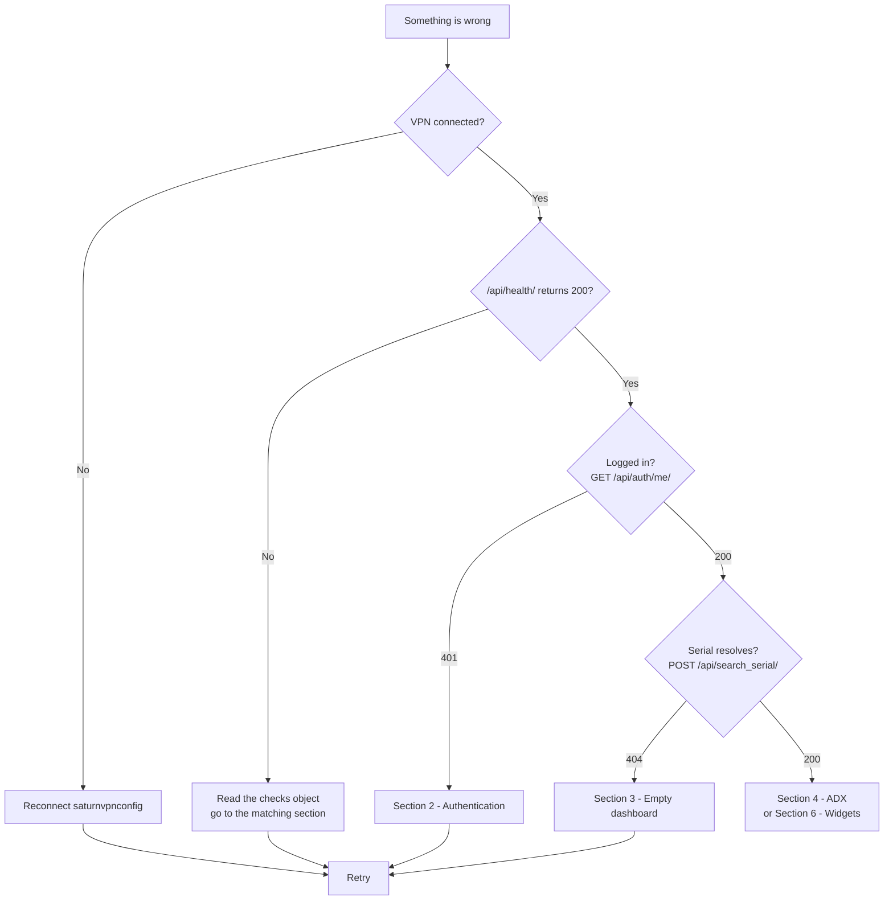
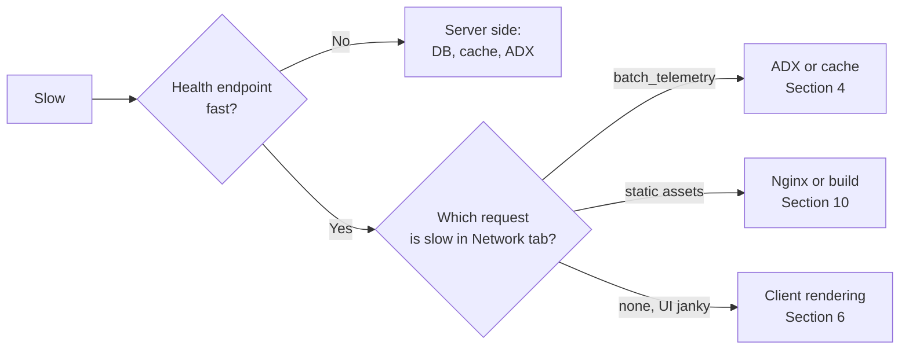

# Troubleshooting Guide

**mysite — Edge Telemetry Dashboard**

A symptom-driven guide for diagnosing and resolving problems. Work top to bottom: start with [First Response](#first-response), then jump to the section matching your symptom.

For escalation paths and contacts, see [Deployment Management](DEPLOYMENT_MANAGEMENT.md#contacts-and-escalation).

---

## Table of Contents

- [First Response](#first-response)
- [Severity and Escalation](#severity-and-escalation)
- [1. Access and Connectivity](#1-access-and-connectivity)
- [2. Authentication and Login](#2-authentication-and-login)
- [3. Blank or Empty Dashboard](#3-blank-or-empty-dashboard)
- [4. Azure Data Explorer Problems](#4-azure-data-explorer-problems)
- [5. Slow Performance](#5-slow-performance)
- [6. Charts and Widgets](#6-charts-and-widgets)
- [7. Events Page](#7-events-page)
- [8. Database Problems](#8-database-problems)
- [9. Cache and Redis](#9-cache-and-redis)
- [10. Static Files and Frontend Build](#10-static-files-and-frontend-build)
- [11. Docker and Container Problems](#11-docker-and-container-problems)
- [12. Nginx and Gunicorn](#12-nginx-and-gunicorn)
- [13. Local Development Setup](#13-local-development-setup)
- [14. Export Problems](#14-export-problems)
- [Diagnostic Command Reference](#diagnostic-command-reference)
- [Log Locations](#log-locations)
- [Reporting a Problem](#reporting-a-problem)

---

## First Response

Run these four checks before anything else. They resolve or correctly classify the large majority of incidents.



**Check 1 — VPN**

```bash
ping <ec2-private-ip>
```

**Check 2 — Service health**

```bash
curl -i http://<host>/api/health/
```

A healthy response:

```json
{ "status": "healthy", "checks": { "database": "ok", "redis": "ok", "adx": "configured" } }
```

Any `503` response names the failing dependency in `checks` — go straight to that dependency's section.

**Check 3 — Session**

Open the browser developer tools, go to Network, reload, and look at `/api/auth/me/`. A `401` means the session is the problem.

**Check 4 — Browser console**

Open the Console tab. CORS errors, chunk-load failures, and JavaScript exceptions all surface here and each points to a specific section below.

---

## Severity and Escalation

| Severity | Definition | Target first response | Action |
| --- | --- | --- | --- |
| **S1 — Critical** | Service down for all users; no data at all | 15 minutes | Escalate immediately; do not troubleshoot alone |
| **S2 — High** | Major feature broken (login, all telemetry, all events) | 1 hour | Diagnose using this guide, escalate if unresolved |
| **S3 — Medium** | Single feature or single device affected | 1 business day | Diagnose and raise an issue |
| **S4 — Low** | Cosmetic, single-user, or has a workaround | Next sprint | Raise an issue |

Escalate to the contacts in [Deployment Management](DEPLOYMENT_MANAGEMENT.md#contacts-and-escalation) when the target first response time is exceeded or when the fix requires credential rotation, infrastructure changes, or a rollback.

---

## 1. Access and Connectivity

### The dashboard URL does not load at all

| Check | Command | Expected |
| --- | --- | --- |
| VPN is up | `ping <ec2-private-ip>` | Replies |
| Host is reachable on port 80 | `curl -I http://<host>/` | `200` or `301` |
| Nginx is running | `sudo systemctl status nginx` | `active (running)` |

**Causes and fixes**

- **VPN disconnected.** The most common cause by a wide margin. Reconnect `saturnvpnconfig` and retry. VPN sessions drop silently on laptop sleep and network changes. See [VPN Access](VPN_ACCESS.md).
- **Wrong URL.** The service is on a private IP; public DNS will not resolve it. Confirm the address with your team lead.
- **Nginx stopped.** `sudo systemctl restart nginx`, then check `/var/log/nginx/error.log`.
- **Host down.** Confirm the EC2 instance state in the AWS console before assuming an application fault.

### Intermittent timeouts, the page loads then stalls

The VPN tunnel is dropping. Reconnect, and if it recurs, capture the VPN client log and escalate to IT — this is not an application fault.

### `ERR_CONNECTION_REFUSED` on the API but the page loads

Nginx is serving static files but cannot reach the application tier.

```bash
sudo supervisorctl status          # bare VM
docker compose ps                  # Docker
curl -I http://127.0.0.1:8000/api/health/
```

If Gunicorn is down, see [Section 12](#12-nginx-and-gunicorn).

---

## 2. Authentication and Login

### Login fails with "invalid credentials"

1. Confirm the username — it is case-sensitive.
2. Have an administrator verify the account exists and is active in the Django admin.
3. Reset the password: `python manage.py changepassword <username>`.

### Login appears to succeed but you are bounced back to the login page

Cookies are being set but not returned. This is nearly always a configuration mismatch.

| Cause | Check | Fix |
| --- | --- | --- |
| Origin not allowlisted | Browser console shows a CORS error | Add the exact scheme, host, and port to `CORS_ALLOWED_ORIGINS` and restart |
| `Secure` cookie over plain HTTP | `DJANGO_SESSION_COOKIE_SECURE=True` but the site is served over HTTP | Either enable TLS or set the flag to `False` for that environment |
| Cross-site cookie blocked | Frontend and API are on different hosts | Serve both through the same Nginx origin (the intended topology) |
| Browser blocking third-party cookies | Test in a private window with default settings | Use the same-origin deployment |

### Logged out every couple of hours

Expected if refresh is failing. Access tokens last 120 minutes; the client should refresh silently.

```bash
curl -i -X POST http://<host>/api/token/refresh/ -b "refresh_token=<token>"
```

If refresh returns `401`, the most likely cause is `JWT_SIGNING_KEY` differing between Gunicorn workers or having changed on restart. Confirm it is set explicitly in `.env` — the code falls back to a development default when it is unset, and that default does not survive a redeploy consistently.

### `403 Forbidden` on `/api/adx/`

That endpoint requires membership of the Django `AdminGroup`. Add the user to the group in the Django admin, then have them log out and back in.

### CSRF failures on POST

Add the origin to `CSRF_TRUSTED_ORIGINS` (including the scheme) and restart. In production this must list the real HTTPS origin, not `localhost`.

---

## 3. Blank or Empty Dashboard

### Every widget is empty, no error is shown

The dashboard renders nothing until a serial is resolved.

1. **Is a serial selected?** Enter one in the search box.
2. **Does the serial exist?**

   ```bash
   curl -X POST http://<host>/api/search_serial/ \
     -H "Content-Type: application/json" \
     -b cookies.txt \
     -d '{"serial":"YOUR_SERIAL"}'
   ```

   A `404` means the serial is not in the ADX `DevInfo` table. Verify the serial with the field team; check for transposed characters and leading zeros.
3. **Is there data in the selected window?** Widen the global time range to 7 days. A device offline for the last 15 minutes will show nothing on the default range.
4. **Has the device reported at all?** Check the last-seen timestamp on the device info panel. A stale timestamp means the problem is upstream in the ingestion pipeline, not in this application.

### Some widgets have data, others are permanently empty

That signal is not being reported by this device or firmware version. Confirm by comparing against another device of the same model. If the signal path changed in a firmware release, the KQL builder needs updating — raise an issue referencing the signal path.

### The page is entirely white

A JavaScript bundle failed to load or execute.

- Hard-reload with cache bypass (`Ctrl+Shift+R`).
- Check the console for `Failed to load module script` or a chunk 404 — this indicates a stale `index.html` referencing hashed assets from a previous build. Rebuild the frontend and re-run `collectstatic`, then clear the CDN or browser cache.
- Check for an uncaught exception naming a component; that is a code defect — capture the stack trace and raise an issue.

---

## 4. Azure Data Explorer Problems

ADX is the source of all telemetry. When it fails, everything downstream looks broken.

### Health check reports `"adx": "not configured"`

One or more of `ADX_CLUSTER_URL`, `ADX_DATABASE`, `ADX_CLIENT_ID`, `ADX_CLIENT_SECRET`, `ADX_TENANT_ID` is missing. Verify `.env`, then restart the application — environment changes are not picked up live.

### Authentication errors from Kusto

```
AADSTS7000215: Invalid client secret provided
AADSTS700016: Application not found in the directory
```

| Message | Cause | Fix |
| --- | --- | --- |
| `Invalid client secret` | Secret expired or mistyped | Rotate the secret in Azure AD, update `.env`, restart. See [credential rotation](DEPLOYMENT_MANAGEMENT.md#credential-rotation) |
| `Application not found` | Wrong `ADX_TENANT_ID` or `ADX_CLIENT_ID` | Re-copy both values from the Azure portal |
| `Forbidden` / `Unauthorized` on query | Service principal lacks database permissions | Grant `Viewer` on the target ADX database |

> Azure AD client secrets expire. Track the expiry date and rotate ahead of it — an expired secret takes out all telemetry with no warning.

### Queries fail with "rate limit exceeded"

The in-process limiter tripped. Note that the limit is **per Gunicorn worker**, so the effective cluster limit is `ADX_MAX_QUERIES_PER_MINUTE × worker count`.

Immediate mitigations, in order of preference:

1. Increase the auto-refresh interval in Settings (the usual culprit is a wall dashboard refreshing every 5 seconds).
2. Increase `ADX_CACHE_TTL` and `ADX_CACHE_TTL_HISTORICAL`.
3. Confirm Redis is in use so the cache is shared across workers rather than duplicated per worker.
4. Raise `ADX_MAX_QUERIES_PER_MINUTE` only after confirming the cost impact.

Inspect the current state:

```bash
curl -b cookies.txt http://<host>/api/adx_stats/
```

A cache hit ratio below roughly 60 % under normal dashboard use indicates the TTLs are too short or Redis is not connected.

### Queries are slow or time out

- Narrow the time range. A 7-day range in fast (15-second) mode returns an enormous result set.
- Prefer normal (15-minute) sampling for anything longer than a few hours.
- Check the ADX cluster health and current load in the Azure portal — cluster-side throttling presents as generalised slowness.

### ADX costs are rising unexpectedly

```bash
curl -b cookies.txt http://<host>/api/adx_stats/
```

Look for a low cache hit ratio and a high query count. Typical causes: Redis down (every worker caching independently), dashboards left open with aggressive refresh, or a client bypassing `/api/batch_telemetry/` and issuing individual raw queries.

---

## 5. Slow Performance

Isolate the layer before optimising.



| Symptom | Likely cause | Fix |
| --- | --- | --- |
| First load is slow, subsequent loads fast | Cold cache | Expected. If it is slow every time, the cache is not working — see [Section 9](#9-cache-and-redis) |
| All API calls slow | Database or ADX latency | Check `/api/health/` timing; check ADX cluster load |
| Only telemetry calls slow | ADX query cost | Narrow the range, use normal sampling, raise TTLs |
| Browser tab uses excessive memory | Too many widgets on long ranges | Collapse unused sections; shorten the range |
| Slow only under concurrent use | Insufficient workers | Increase `GUNICORN_WORKERS` (rule of thumb: `2 × CPU + 1`) |

---

## 6. Charts and Widgets

| Symptom | Cause | Fix |
| --- | --- | --- |
| Chart shows "No data" but the device is online | Signal not reported, or range too narrow | Widen the range; verify the signal on another device |
| Timestamps look shifted | Display timezone differs from site timezone | Set the timezone in Settings; ADX stores site-local time |
| Line has large gaps | Genuine reporting gaps (connectivity loss) | Cross-check the Events page for connectivity alarms in the same window |
| Values look wrong by a constant factor | Unit or scaling mismatch in the widget config | Raise an issue naming the widget and the signal path |
| Discrete widget shows a raw number instead of a label | Unmapped state code from newer firmware | Raise an issue; the value mapping in `widgetConfigs.ts` needs the new code |
| Fast mode returns nothing | Fast sampling not enabled on the device, or the range is too old | Try a recent, short window; fall back to normal mode |
| Chart does not refresh | Auto-refresh set to Off, or the tab is backgrounded | Check Settings; bring the tab to the foreground |
| Gauge needle stuck at zero | Instantaneous value missing from the batch response | Reload; if it persists, check `/api/batch_telemetry/` in the Network tab |

---

## 7. Events Page

| Symptom | Cause | Fix |
| --- | --- | --- |
| No events listed | No alarms in the window, or filters exclude everything | Reset all filters, set output state to All, widen the range |
| Table appears truncated | Default rendering caps at 500 rows | Use the expand control (hard ceiling 20 000 rows); narrow the range for a complete view |
| Pareto percentages do not reach 100 % | The chart covers only the displayed subset | Narrow the time range so the full set is within the row cap |
| An event has the wrong severity | Severity is derived from the event name path | Raise an issue with the exact event name; the parser rules need extending |
| Search returns nothing for a known event | Search matches the raw event name, not the display label | Search a fragment of the path, for example `RELAY` |
| Page hangs when expanding | Rendering tens of thousands of rows | Narrow the range before expanding |

---

## 8. Database Problems

### Health check reports `"database"` failing

```bash
# Docker
docker compose ps db
docker compose logs db --tail=50
docker compose exec db pg_isready -U mysite_user

# Bare VM
sudo systemctl status postgresql
```

| Cause | Fix |
| --- | --- |
| Container or service not running | `docker compose up -d db` or `sudo systemctl start postgresql` |
| Wrong credentials | Verify `DB_USER`, `DB_PASSWORD`, `DB_NAME`, `DB_HOST` in `.env`; in Docker `DB_HOST` must be `db`, not `localhost` |
| Connection limit reached | Check `max_connections`; confirm `CONN_MAX_AGE` is not set excessively high |
| Disk full | `df -h`; clear old logs and backups |

### `relation "..." does not exist`

Migrations have not been applied.

```bash
make migrate            # local
make docker-migrate     # Docker
```

### `no such table: django_session` locally

The development SQLite database was never migrated. Run `make migrate`.

### Migration conflict after a merge

```bash
cd backend && python manage.py showmigrations
```

Resolve by merging the migration branches (`makemigrations --merge`) rather than deleting migration files. Never delete applied migrations from a shared environment.

---

## 9. Cache and Redis

Redis is a performance and cost optimisation, not a correctness dependency. Its loss degrades the system; it should not break it.

```bash
docker compose exec redis redis-cli ping     # expect PONG
redis-cli -u "$REDIS_URL" ping               # bare VM
```

| Symptom | Cause | Fix |
| --- | --- | --- |
| Health check reports `"redis"` failing | Service down or `REDIS_URL` wrong | Start Redis; in Docker the URL must be `redis://redis:6379/1` |
| Everything works but is slow, ADX cost rising | Cache silently unavailable, `CACHE_BACKEND=memory` in a multi-worker deployment | Set `CACHE_BACKEND=redis` and confirm connectivity |
| Stale values shown after a device update | TTL not yet expired | Wait for the TTL (30 s live, 300 s historical) or flush: `docker compose exec redis redis-cli FLUSHDB` |

> Flushing the cache is safe — it holds only derived query results — but it causes a temporary ADX load spike as caches refill.

---

## 10. Static Files and Frontend Build

| Symptom | Cause | Fix |
| --- | --- | --- |
| Admin pages unstyled | `collectstatic` not run | `make collectstatic` and restart |
| `404` on hashed JS or CSS assets | Frontend rebuilt but assets not redeployed, or a stale `index.html` is cached | Rebuild, redeploy, then hard-reload the browser |
| Old UI persists after deployment | Browser or proxy cache | Hard-reload; assets are content-hashed so a correct deploy always invalidates |
| `npm run build` fails on type errors | TypeScript errors block the build by design | Fix the reported errors; do not bypass the type check |
| Build fails with an out-of-memory error | Node heap exhausted | `NODE_OPTIONS=--max-old-space-size=4096 npm run build` |
| `npm ci` fails | Lockfile out of sync with `package.json` | Run `npm install` locally, commit the updated lockfile |

---

## 11. Docker and Container Problems

### A container will not start

```bash
docker compose ps
docker compose logs <service> --tail=100
```

| Cause | Fix |
| --- | --- |
| Missing required environment variable | Backend refuses to start in production mode without `DJANGO_SECRET_KEY`; check `.env` |
| Port already in use | `netstat -ano \| findstr :80` (Windows) or `sudo lsof -i :80`; stop the conflicting process |
| Dependency unhealthy | `backend` waits for healthy `db` and `redis`; fix those first |
| Image build failure | `docker compose build --no-cache <service>` and read the failing layer |

### Backend restarts in a loop

Read the logs immediately after a restart — the failure is printed before the exit.

```bash
docker compose logs backend --tail=100
```

Common causes: unreachable database, failed migration, missing environment variable, or a production startup validation failure (`SECRET_KEY`, `DEBUG`, `ALLOWED_HOSTS`).

### Changes to `.env` have no effect

Environment variables are read at process start. Recreate the containers:

```bash
docker compose up -d --force-recreate backend
```

### Disk filling up on the host

```bash
docker system df
make docker-clean          # prunes dangling images and build cache, keeps volumes
```

> Never run `docker system prune --volumes` on the production host. It destroys the PostgreSQL data volume.

---

## 12. Nginx and Gunicorn

### `502 Bad Gateway`

Nginx is running but the upstream is not answering.

```bash
sudo supervisorctl status                       # bare VM
docker compose ps backend                       # Docker
curl -I http://127.0.0.1:8000/api/health/
sudo tail -50 /var/log/nginx/error.log
```

Fix: start or restart Gunicorn (`sudo supervisorctl restart mysite:*` or `docker compose restart backend`), then confirm the upstream address matches the topology — `127.0.0.1:8000` on a bare VM, `backend:8000` in Docker.

### `504 Gateway Timeout`

The request exceeded the Gunicorn timeout (60 s), almost always a long ADX query. Narrow the time range and use normal sampling. Raising the timeout hides the problem rather than solving it.

### `413 Request Entity Too Large`

Nginx caps request bodies at 10 MB. Reduce the payload, or raise `client_max_body_size` if the larger size is genuinely required.

### Nginx will not reload

```bash
sudo nginx -t
```

Fix the reported syntax error before reloading. Never restart Nginx with an invalid configuration.

### Gunicorn workers being killed

Look for `WORKER TIMEOUT` in the Gunicorn log. Causes: a long-running ADX query, or memory pressure. Workers recycle after 1 000 requests by design; occasional restarts in the log are normal.

---

## 13. Local Development Setup

| Symptom | Cause | Fix |
| --- | --- | --- |
| `ModuleNotFoundError` on any package | Virtual environment not activated | Activate `venv`, then `make install-backend` |
| Frontend cannot reach the API | Backend not running, or Vite proxy misconfigured | Start the backend on port 8000; confirm the `/api` proxy in `vite.config.ts` |
| CORS error in development | Vite port differs from the allowlisted origin | Add the actual origin to `CORS_ALLOWED_ORIGINS` |
| `make` not recognised on Windows | GNU Make not installed | Use Git Bash or WSL, or `choco install make` |
| `.env` values ignored | File in the wrong location | `.env` belongs in the repository root, not in `backend/` |
| Port 8000 or 5173 already in use | Previous process still running | Kill it, or run on a different port |
| ADX calls fail locally | VPN not connected | Connect `saturnvpnconfig`; ADX is unreachable without it |

---

## 14. Export Problems

| Symptom | Cause | Fix |
| --- | --- | --- |
| CSV is empty | Widget had no data when exported | Confirm data is visible on screen first |
| CSV timestamps look wrong in Excel | Excel reformats ISO timestamps on open | Import as text rather than double-clicking the file |
| PDF export is blank or clipped | Charts had not finished rendering | Wait for all widgets to load, then export |
| PDF colours look wrong | Dark theme renders poorly on paper | Switch to light theme before exporting |
| Export button does nothing | Browser blocked the download | Check the download blocked indicator in the address bar |

---

## Diagnostic Command Reference

```bash
# Health and status
make health                         # containerised health endpoint
make health-dev                     # local development health endpoint
make ps                             # container status
make vm-status                      # Supervisor and Nginx on the production VM

# Logs
make logs-backend
make logs-nginx
make vm-logs

# Data path
curl -X POST http://<host>/api/login/ -H "Content-Type: application/json" \
  -c cookies.txt -d '{"username":"u","password":"p"}'
curl -b cookies.txt http://<host>/api/auth/me/
curl -X POST http://<host>/api/search_serial/ -H "Content-Type: application/json" \
  -b cookies.txt -d '{"serial":"SERIAL"}'
curl -b cookies.txt http://<host>/api/adx_stats/

# Configuration checks
make check                          # Django system checks
make check-deploy                   # production readiness checks
make migrate-check                  # unapplied model changes

# Recovery
make restart SERVICE=backend
make vm-restart
docker compose exec redis redis-cli FLUSHDB
```

> `cookies.txt` stores a live session token. Delete it when finished and never commit it.

---

## Log Locations

| Source | Docker | Bare VM |
| --- | --- | --- |
| Django application | `docker compose logs backend` | Supervisor Gunicorn log |
| Gunicorn access and error | `docker compose logs backend` | `/var/log/mysite/gunicorn.log` |
| Nginx access | `docker compose logs nginx` | `/var/log/nginx/access.log` |
| Nginx error | `docker compose logs nginx` | `/var/log/nginx/error.log` |
| PostgreSQL | `docker compose logs db` | `/var/log/postgresql/` |
| Redis | `docker compose logs redis` | `/var/log/redis/` |
| Supervisor | n/a | `/var/log/supervisor/supervisord.log` |
| Application file log | `backend/logs/django.log` | `backend/logs/django.log` |

---

## Reporting a Problem

Include all of the following. Reports missing this information cannot be actioned and will be returned.

| Field | Example |
| --- | --- |
| Severity | S2 |
| Environment | Production / Staging / Local |
| Time and timezone of occurrence | 2026-09-03 14:32 CET |
| Device serial (if applicable) | `ABC123456789` |
| Page and action | Events page, applying the Critical severity filter |
| Expected vs actual | Expected filtered rows; the table went blank |
| Reproducible? | Yes, every time |
| Browser and version | Chrome 128 |
| Health endpoint output | Paste the JSON from `/api/health/` |
| Browser console errors | Paste the full text, not a screenshot |
| Relevant server log excerpt | Last 50 lines around the timestamp |

> Redact tokens, cookies, passwords, and connection strings before sharing logs. Never paste the contents of `.env` into an issue or chat.

Route the report according to [Deployment Management](DEPLOYMENT_MANAGEMENT.md#contacts-and-escalation).

---

## Related Documents

| Document | Purpose |
| --- | --- |
| [README](../README.md) | Architecture, setup, API reference |
| [Deployment Management](DEPLOYMENT_MANAGEMENT.md) | Release process, rollback, contacts, on-call |
| [VPN Access](VPN_ACCESS.md) | `saturnvpnconfig` onboarding |
| [SRS](SRS.md) | Requirements and known gaps |
